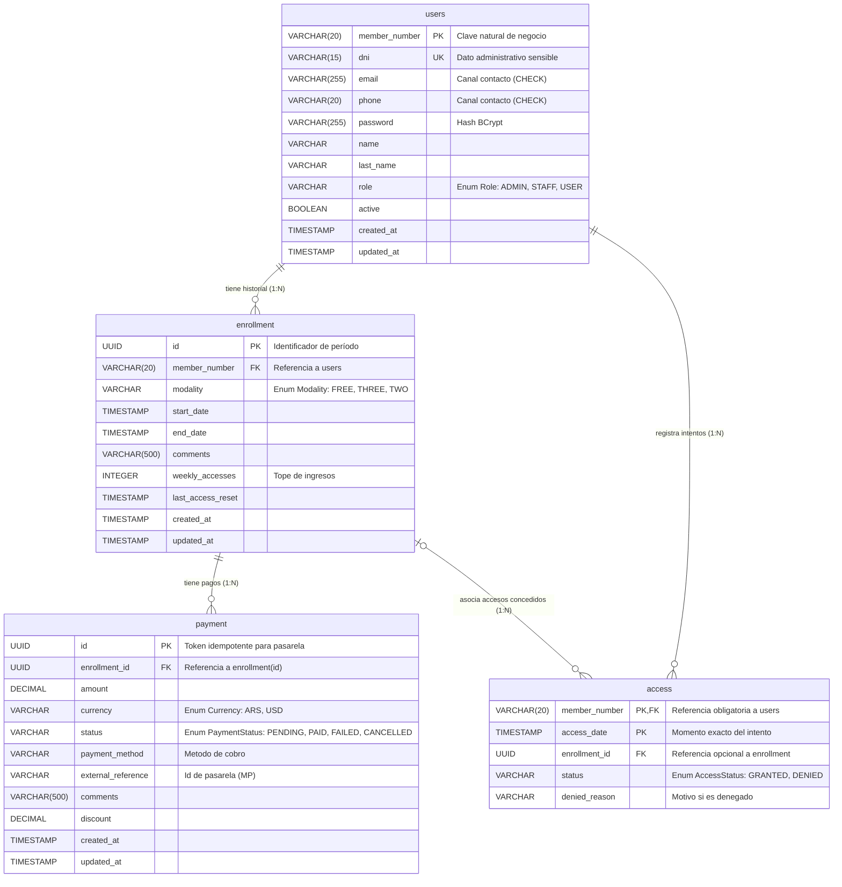

# Modelo de Datos — Esquema Relacional
Documentación técnica completa del esquema de la base de datos. Este archivo contiene el detalle de cada entidad, sus atributos, las anotaciones JPA y las relaciones entre ellas. La versión resumida y orientada al uso está en el `README.md`.

## Stack

- **ORM:** Hibernate / JPA
- **Base de datos:** PostgreSQL
- **Creación de esquema:** script manual (archivo `schema.sql`).
- **Generación de claves:** `GenerationType.UUID`

## Diagrama de entidades

## Justificación de Claves

Para garantizar la solidez del modelo relacional y evitar el abuso de IDs artificiales, se aplicaron los siguientes criterios de selección de claves primarias:

| Entidad | ¿Posee Clave Natural Estable? | Naturaleza Conceptual | Tipo de PK Seleccionada | Justificación Académica y Operativa |
|---------|-------------------------------|-----------------------|-------------------------|-------------------------------------|
| `users` | Sí (`member_number`) | Fuerte / Negocio | Clave Natural (`member_number`) | Identidad real del socio, credencial física y tipeo en terminales. |
| `access`| Sí (`member_number` + `access_date`) | Evento temporal puntual | Clave Compuesta (`member_number`, `access_date`) | Evento puntual inmutable; evita proliferación de UUIDs por cada intento de acceso en la terminal. |
| `enrollment` | No (fechas mutables) | Período contractual dependiente | Subrogada (`UUID`) | Evita PKs compuestas mutables y cascadas sobre tablas dependientes. |
| `payment` | No (transaccional) | Transacción financiera | Subrogada (`UUID`) | Token idempotente para conciliación de webhooks y pasarelas de pago. |

## Relaciones

| Relación | Tipo | Descripción |
|----------|------|-------------|
| `users` ↔ `enrollment` | `1:N` (Uno a Muchos) | Un usuario puede tener múltiples inscripciones a lo largo del tiempo (historial). |
| `enrollment` ↔ `payment` | `1:N` (Uno a Muchos) | Una inscripción puede registrar múltiples pagos o intentos de cobro. |
| `users` ↔ `access` | `1:N` (Uno a Muchos) | Un usuario puede registrar múltiples intentos de acceso en la terminal. |
| `enrollment` ↔ `access` | `1:N` (Uno a Muchos) | Una inscripción asocia los accesos concedidos durante su vigencia (relación opcional). |

---

## Entidad: `User`

Representa a un socio, personal o administrador del gimnasio.

**Nota de Privacidad y Contacto:** Se utiliza el número de socio (`member_number`) como identificador principal operativo para proteger el DNI. Para evitar "socios fantasmas", el sistema exige obligatoriamente registrar un email o un teléfono de contacto mediante una restricción de base de datos (`CHECK`).

### Tabla `users`

| Columna | Tipo | Nulos | Único | Observación |
|---------|------|-------|-------|-------------|
| `member_number` | VARCHAR(20) | No | Sí (PK) | Clave primaria natural |
| `dni` | VARCHAR(15) | No | Sí (UK)| Dato administrativo sensible |
| `email` | VARCHAR(255)| Sí* | Sí | *Restricción CHECK: email o phone obligatorios |
| `phone` | VARCHAR(20) | Sí* | — | *Restricción CHECK: email o phone obligatorios |
| `password` | VARCHAR(255)| Sí | — | Hash BCrypt |
| `name` | VARCHAR | No | — | |
| `last_name` | VARCHAR | No | — | |
| `role` | VARCHAR | No | — | Valor del Enum `Role` (Por defecto `USER`) |
| `active` | BOOLEAN | No | — | Valor por defecto `true` |
| `created_at` | TIMESTAMP | No | — | Generado automáticamente |
| `updated_at` | TIMESTAMP | Sí | — | Actualizado automáticamente |

---

## Entidad: `Enrollment`

Representa la inscripción de un usuario a un plan, con su modalidad y vigencia.

### Tabla `enrollment`

| Columna | Tipo | Nulos | Único | Observación |
|---------|------|-------|-------|-------------|
| `id` | UUID | No (generado) | Sí (PK)| Clave primaria |
| `member_number` | VARCHAR(20) | No | — | FK a `users.member_number` |
| `modality` | VARCHAR | No | — | Valor del Enum `Modality` |
| `start_date` | TIMESTAMP | No | — | |
| `end_date` | TIMESTAMP | No | — | |
| `comments` | VARCHAR(500) | Sí | — | |
| `weekly_accesses` | INTEGER | No | — | Tope de ingresos |
| `last_access_reset` | TIMESTAMP | Sí | — | |
| `created_at` | TIMESTAMP | No | — | Generado automáticamente |
| `updated_at` | TIMESTAMP | Sí | — | Actualizado automáticamente |

---

## Entidad: `Access`

Registra cada intento de ingreso validado en la terminal de acceso.

### Tabla `access`

| Columna | Tipo | Nulos | Único | Observación |
|---------|------|-------|-------|-------------|
| `member_number` | VARCHAR(20) | No | — | PK Compuesta / FK a `users` |
| `access_date` | TIMESTAMP | No | — | PK Compuesta (Momento exacto) |
| `enrollment_id` | UUID | Sí | — | FK opcional a `enrollment.id` (permite denegados sin plan) |
| `status` | VARCHAR | No | — | Valor del Enum `AccessStatus` |
| `denied_reason` | VARCHAR(500) | Sí | — | Motivo si es denegado |

---

## Entidad: Payment

Registra los cobros asociados a las inscripciones, operando con tokens idempotentes para integraciones externas.

### Tabla `payment`

| Columna | Tipo | Nulos | Único | Observación |
| :--- | :--- | :--- | :--- | :--- |
| `id` | UUID | No (generado) | — | Clave primaria (Token idempotente) |
| `enrollment_id` | UUID | No | — | FK a `enrollment.id` |
| `amount` | DECIMAL(19,2) | No | — | |
| `currency` | VARCHAR | No | — | Valor del Enum `Currency` (ARS, USD) |
| `status` | VARCHAR | No | — | Valor del Enum `PaymentStatus` |
| `payment_method` | VARCHAR | No | — | Método de cobro |
| `external_reference`| VARCHAR | Sí | — | ID de pasarela (ej. Mercado Pago) |
| `comments` | VARCHAR(500) | Sí | — | |
| `discount` | DECIMAL(19,2) | Sí | — | |
| `created_at` | TIMESTAMP | No | — | Generado automáticamente |
| `updated_at` | TIMESTAMP | Sí | — | Actualizado automáticamente |
---

## Dominios de Valores (Enums)

Para garantizar la integridad de los datos a nivel conceptual, los siguientes campos operan bajo dominios de valores cerrados:

*   **Role (Tabla `users`):** `ADMIN` (acceso total), `STAFF` (personal operativo), `USER` (socio/reservado).
*   **Modality (Tabla `enrollment`):** `FREE` (acceso ilimitado), `THREE` (3 accesos por semana), `TWO` (2 accesos por semana).
*   **Currency (Tabla `payment`):** `ARS` (Peso argentino), `USD` (Dólar estadounidense).
*   **PaymentStatus (Tabla `payment`):** `PENDING` (pendiente), `PAID` (pagado), `FAILED` (fallido), `CANCELLED` (cancelado para auditoría).
*   **AccessStatus (Tabla `access`):** `GRANTED` (acceso permitido), `DENIED` (acceso denegado).

## Fundamentos de Diseño Relacional

Para el modelado de esta base de datos, se aplicaron estrictos criterios de diseño relacional, priorizando el uso de claves naturales y compuestas sobre la asignación automática de identificadores subrogados, salvo en casos donde la mutabilidad o la integración externa lo requieran.

**1. Uso de Clave Natural frente a UUID en Usuarios (`users`)**

El "número de socio" es la identidad unívoca del cliente. Es el dato que el usuario digita en la terminal de acceso. Utilizar `member_number` como PK elimina la sobrecarga de mantener dos identificadores únicos concurrentes (un UUID artificial + el número de socio), simplificando drásticamente las consultas (JOIN) con las tablas dependientes.

**2. Criterio de Privacidad frente al DNI (Privacy by Design)**

Aunque el DNI es natural y único, identifica a la persona ante el Estado. Su exposición indebida en pantallas de terminales de acceso representa un riesgo de privacidad.
Por lo tanto, el DNI se aisló con una restricción `UNIQUE NOT NULL` como clave alternativa exclusivamente para fines administrativos (legajo, facturación), pero no participa como identificador relacional en las transacciones operativas diarias.

**3. Garantía de Canal de Contacto**

Para evitar el registro de "socios fantasmas" incontactables ante vencimientos, se implementó una restricción a nivel de motor de base de datos: `CONSTRAINT chk_user_contact CHECK (email IS NOT NULL OR phone IS NOT NULL)`. Esto garantiza al menos una vía de comunicación válida sin hacer obligatorias ambas.

**4. Clave Primaria Compuesta en Eventos Temporales (`access`)**

Un intento de acceso en la terminal no es una entidad independiente que requiera una clave artificial (UUID); es un evento temporal.
Su identidad unívoca natural está determinada por quién intentó pasar (`member_number`) y en qué instante exacto lo hizo (`access_date`). Al usar esta clave compuesta, el evento queda registrado de forma inmutable, permitiendo además auditar accesos denegados sin depender de una inscripción activa.

**5. Uso Justificado de UUID en Entidades Específicas**
*   **En `enrollment` (Mutabilidad):** Las fechas de inicio y fin de una suscripción son inherentemente mutables (suspensiones, vacaciones, prórrogas). Si usáramos una PK compuesta basada en fechas, cualquier modificación forzaría una cascada de actualizaciones compleja en tablas dependientes. El UUID provee una identidad inmutable que independiza el contrato de sus ajustes temporales.
*   **En `payment` (Idempotencia externa):** En la integración con pasarelas de pago externas (ej. Mercado Pago), el sistema debe despachar un identificador único atómico previo a la redirección. El UUID funciona como un token idempotente para conciliar la transacción mediante webhooks de forma segura, sin exponer datos sensibles del negocio.