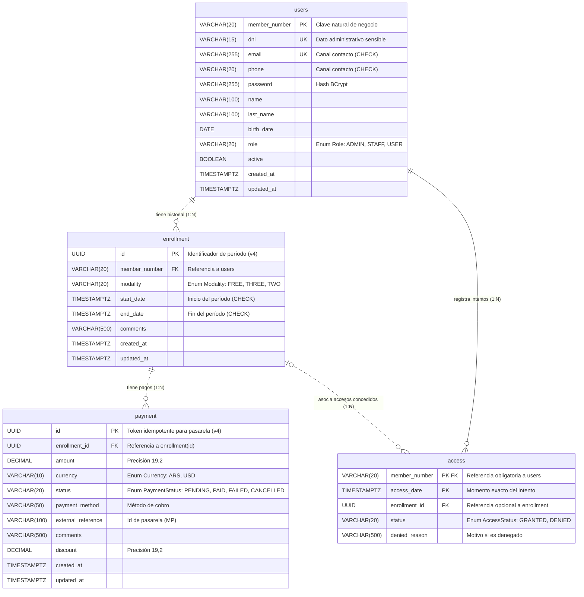

# Modelo Relacional de Base de Datos

Documentación técnica completa del esquema de la base de datos. Este archivo contiene el detalle de cada tabla, sus columnas, tipos de datos, restricciones y las relaciones entre ellas. La versión resumida y orientada al uso está en el `README.md`.

## Diagrama de entidades

**Notación del diagrama:** la línea continua representa una relación identificadora (la clave del padre forma parte de la clave primaria del hijo, como `member_number` en `access`); la línea punteada, una relación no identificadora (el hijo tiene su propia clave primaria y solo referencia al padre).

## Justificación de Claves

Para garantizar la solidez del modelo relacional y evitar el abuso de IDs artificiales, se aplicaron los siguientes criterios de selección de claves primarias:

| Entidad | ¿Posee Clave Natural Estable? | Naturaleza Conceptual | Tipo de PK Seleccionada | Justificación Académica y Operativa |
|---------|-------------------------------|-----------------------|-------------------------|-------------------------------------|
| `users` | Sí (`member_number`) | Fuerte / Negocio | Clave Natural (`member_number`) | Identidad real del socio, credencial física y tipeo en terminales. |
| `access`| Sí (`member_number` + `access_date`) | Evento temporal puntual | Clave Compuesta (`member_number`, `access_date`) | Evento puntual inmutable; evita proliferación de UUIDs por cada intento de acceso en la terminal. |
| `enrollment` | No (fechas mutables) | Período contractual dependiente | Subrogada (`UUID` v4) | Evita PKs compuestas mutables y cascadas sobre tablas dependientes. |
| `payment` | No (transaccional) | Transacción financiera | Subrogada (`UUID` v4) | Token idempotente para conciliación de webhooks y pasarelas de pago. |

## Relaciones

| Relación | Tipo | Descripción |
|----------|------|-------------|
| `users` ↔ `enrollment` | `1:N` (Uno a Muchos), no identificadora | Un usuario puede tener múltiples inscripciones a lo largo del tiempo (historial por período). |
| `users` ↔ `access` | `1:N` (Uno a Muchos), identificadora | Un usuario puede registrar múltiples intentos de acceso (historial de accesos). |
| `enrollment` ↔ `payment` | `1:N` (Uno a Muchos), no identificadora | Una inscripción puede registrar múltiples pagos o intentos de cobro. |
| `enrollment` ↔ `access` | `1:N` (Uno a Muchos), no identificadora | Una inscripción asocia los accesos concedidos durante su vigencia (opcional; nulo si el acceso fue denegado sin inscripción activa). |

---

## Tabla: `users`

Representa a un socio, personal o administrador del gimnasio.

**Nota de Privacidad y Contacto:** Se utiliza el número de socio (`member_number`) como identificador principal operativo para proteger el DNI. Para evitar "socios fantasmas", el sistema exige obligatoriamente registrar un email o un teléfono de contacto mediante una restricción de base de datos (`CHECK`).

**Nota de Escalabilidad (Credenciales opcionales):** Para la versión 1, los usuarios con rol `USER` (Socios) son dados de alta exclusivamente por el administrador y no poseen acceso al sistema, por lo que el campo `password` será nulo para ellos. La tabla se diseñó unificada para permitir a futuro habilitarles credenciales sin reestructurar la base de datos (ej. para un portal de autogestión).

### Tabla `users`

| Columna | Tipo | Nulos | Único | Observación |
|---------|------|-------|-------|-------------|
| `member_number` | VARCHAR(20) | No | Sí (PK) | Clave primaria natural |
| `dni` | VARCHAR(15) | No | Sí (UK)| Dato administrativo sensible |
| `email` | VARCHAR(255)| Sí | Sí (UK) | Restricción CHECK: email o phone obligatorios |
| `phone` | VARCHAR(20) | Sí | — | Restricción CHECK: email o phone obligatorios |
| `password` | VARCHAR(255)| Sí | — | Hash BCrypt |
| `name` | VARCHAR(100) | No | — | |
| `last_name` | VARCHAR(100) | No | — | |
| `birth_date` | DATE | Sí | — | |
| `role` | VARCHAR(20) | No | — | Valor del Enum `Role` (Por defecto `USER`, restricción CHECK) |
| `active` | BOOLEAN | No | — | Valor por defecto `true` |
| `created_at` | TIMESTAMPTZ | No | — | Por defecto `CURRENT_TIMESTAMP` |
| `updated_at` | TIMESTAMPTZ | Sí | — | Sin actualización automática en la base. La aplicación deberá asignarlo al modificar el registro |

---

## Tabla: `enrollment`

Representa la inscripción de un usuario a un plan, con su modalidad y vigencia.

**Nota de Vigencia:** cada inscripción es un período cerrado: siempre tiene fecha de inicio y de fin, y cada renovación genera una inscripción nueva. Una inscripción está vigente cuando `start_date <= momento < end_date`: el inicio se incluye y el fin no. Así, una renovación puede empezar en el mismo instante en que termina la anterior sin que se superpongan. La restricción `chk_enrollment_dates` exige que el fin sea posterior al inicio.

**Nota de Cupo Semanal:** la tabla no guarda un contador de accesos. El tope surge de la modalidad (`THREE`: 3, `TWO`: 2, `FREE`: sin tope) y los accesos ya usados se cuentan en la tabla `access` (ver Fundamentos de Diseño Relacional, punto 7).

| Columna | Tipo | Nulos | Único | Observación |
|---------|------|-------|-------|-------------|
| `id` | UUID | No (generado) | Sí (PK) | Clave primaria. UUID v4 generado por la base con `gen_random_uuid()` |
| `member_number` | VARCHAR(20) | No | — | FK a `users.member_number` (`ON DELETE RESTRICT`) |
| `modality` | VARCHAR(20) | No | — | Valor del Enum `Modality` (Restricción CHECK) |
| `start_date` | TIMESTAMPTZ | No | — | Inicio del período (incluido). Restricción CHECK: anterior a `end_date` |
| `end_date` | TIMESTAMPTZ | No | — | Fin del período (excluido). Restricción CHECK: posterior a `start_date` |
| `comments` | VARCHAR(500) | Sí | — | |
| `created_at` | TIMESTAMPTZ | No | — | Por defecto `CURRENT_TIMESTAMP` |
| `updated_at` | TIMESTAMPTZ | Sí | — | Sin actualización automática en la base. La aplicación deberá asignarlo al modificar el registro |

---

## Tabla: `access`

Registra cada intento de ingreso validado en la terminal de acceso.

| Columna | Tipo | Nulos | Único | Observación |
|---------|------|-------|-------|-------------|
| `member_number` | VARCHAR(20) | No | En conjunto (PK compuesta) | Clave primaria compuesta (PK), FK a `users.member_number` (`ON DELETE RESTRICT`) |
| `access_date` | TIMESTAMPTZ | No | En conjunto (PK compuesta) | Clave primaria compuesta (PK). Por defecto `CURRENT_TIMESTAMP` |
| `enrollment_id` | UUID | Sí | — | FK a `enrollment.id` (`ON DELETE RESTRICT`). Opcional (puede ser nulo en accesos denegados) |
| `status` | VARCHAR(20) | No | — | Valor del Enum `AccessStatus` (Por defecto `GRANTED`, restricción CHECK) |
| `denied_reason` | VARCHAR(500) | Sí | — | Motivo si es denegado |

---

## Tabla: `payment`

Registra un pago asociado a una inscripción.

| Columna | Tipo | Nulos | Único | Observación |
|---------|------|-------|-------|-------------|
| `id` | UUID | No (generado) | Sí (PK) | Clave primaria. UUID v4 generado por la base con `gen_random_uuid()` |
| `enrollment_id` | UUID | No | — | FK a `enrollment.id` (`ON DELETE RESTRICT`) |
| `amount` | DECIMAL(19,2) | No | — | |
| `currency` | VARCHAR(10) | No | — | Valor Enum `Currency` (Por defecto `ARS`, restricción CHECK) |
| `status` | VARCHAR(20) | No | — | Valor del Enum `PaymentStatus` (Por defecto `PENDING`, restricción CHECK) |
| `payment_method` | VARCHAR(50) | Sí | — | Método de pago (ej. tarjeta, mercadopago) |
| `external_reference` | VARCHAR(100) | Sí | — | Referencia externa de transacción |
| `comments` | VARCHAR(500) | Sí | — | |
| `discount` | DECIMAL(19,2) | Sí | — | |
| `created_at` | TIMESTAMPTZ | No | — | Por defecto `CURRENT_TIMESTAMP` |
| `updated_at` | TIMESTAMPTZ | Sí | — | Sin actualización automática en la base. La aplicación deberá asignarlo al modificar el registro |

---

## Dominios de Valores (Enums)

Para garantizar la integridad de los datos a nivel conceptual, los siguientes campos operan bajo dominios de valores cerrados y están validados a nivel de motor de base de datos (`CHECK`):

### `Role` (Tabla `users`)
- `ADMIN`: Personal con acceso total al panel administrativo.
- `STAFF`: Personal operativo (instructores, recepcionistas).
- `USER`: Socio / usuario (sin acceso al sistema en V1; reservado para escalabilidad futura).

### `Modality` (Tabla `enrollment`)
- `FREE`: Acceso ilimitado.
- `THREE`: 3 accesos por semana.
- `TWO`: 2 accesos por semana.

### `Currency` (Tabla `payment`)
- `ARS`: Peso argentino.
- `USD`: Dólar estadounidense.

### `PaymentStatus` (Tabla `payment`)
- `PENDING`: Pago pendiente de confirmación.
- `PAID`: Pago completado y acreditado.
- `FAILED`: Pago fallido o rechazado.
- `CANCELLED`: Pago cancelado para auditoría.

### `AccessStatus` (Tabla `access`)
- `GRANTED`: Acceso permitido.
- `DENIED`: Acceso denegado.

## Índices

PostgreSQL crea automáticamente un índice por cada clave primaria y por cada restricción `UNIQUE` (`users.member_number`, `users.dni`, `users.email`, `enrollment.id`, `payment.id` y la clave compuesta de `access`), pero no indexa las claves foráneas. Por eso el esquema define los siguientes índices B-Tree:

| Índice | Tabla (columna) | Consultas que acelera |
|--------|-----------------|-----------------------|
| `ix_enrollment_member_number` | `enrollment` (`member_number`) | Historial de inscripciones en la ficha del socio y búsqueda de la inscripción vigente en cada validación de acceso. También el control de `ON DELETE RESTRICT` al intentar borrar un socio. |
| `ix_payment_enrollment_id` | `payment` (`enrollment_id`) | Pagos de una inscripción al cobrar en caja y al controlar la cuota. También el control de `RESTRICT` al intentar borrar una inscripción. |
| `ix_access_enrollment_id` | `access` (`enrollment_id`) | Accesos habilitados por una inscripción (auditoría). También el control de `RESTRICT` al intentar borrar una inscripción. |
| `ix_access_access_date` | `access` (`access_date`) | Consultas por fecha sobre todos los socios: accesos del día, horarios pico del dashboard y filtros `from` / `to` de RF-17. |

`access.member_number` no tiene un índice propio: es la primera columna de la clave primaria (`member_number`, `access_date`), cuyo índice ya sirve para buscar los accesos de un socio y para calcular el cupo semanal.

## Fundamentos de Diseño Relacional

Para el modelado de esta base de datos, se aplicaron estrictos criterios de diseño relacional, priorizando el uso de claves naturales y compuestas sobre la asignación automática de identificadores subrogados, salvo en casos donde la mutabilidad o la integración externa lo requieran.

**1. Uso de Clave Natural frente a UUID en Usuarios (`users`)**

El "número de socio" es la identidad unívoca del cliente. Es el dato que el usuario digita en la terminal de acceso. Utilizar `member_number` como PK elimina la sobrecarga de mantener dos identificadores únicos concurrentes (un UUID artificial + el número de socio), simplificando drásticamente las consultas (JOIN) con las tablas dependientes.

**2. Criterio de Privacidad frente al DNI (Privacy by Design)**

Aunque el DNI es natural y único, identifica a la persona ante el Estado. Su exposición indebida en pantallas de terminales de acceso representa un riesgo de privacidad.
Por lo tanto, el DNI se aisló con una restricción `UNIQUE NOT NULL` como clave alternativa exclusivamente para fines administrativos (legajo, facturación), pero no participa como identificador relacional en las transacciones operativas diarias.

**3. Garantía de Canal de Contacto**

Para evitar el registro de "socios fantasmas" incontactables ante vencimientos, se implementó una restricción a nivel de motor de base de datos: `CONSTRAINT chk_user_contact CHECK (email IS NOT NULL OR phone IS NOT NULL)`. Esto garantiza al menos una vía de comunicación válida sin hacer obligatorias ambas.

**4. Clave Primaria Compuesta en Eventos Temporales (`access`)**

Un intento de acceso en la terminal no es una entidad independiente que requiera una clave artificial (UUID); es un evento temporal.
Su identidad unívoca natural está determinada por quién intentó pasar (`member_number`) y en qué instante exacto lo hizo (`access_date`). Al usar esta clave compuesta, el evento queda registrado de forma inmutable, permitiendo además auditar accesos denegados sin depender de una inscripción activa.

**5. Uso Justificado de UUID en Entidades Específicas**
*   **En `enrollment` (Mutabilidad):** Las fechas de inicio y fin de una suscripción son inherentemente mutables (suspensiones, vacaciones, prórrogas). Si usáramos una PK compuesta basada en fechas, cualquier modificación forzaría una cascada de actualizaciones compleja en tablas dependientes. El UUID provee una identidad inmutable que independiza el contrato de sus ajustes temporales.
*   **En `payment` (Idempotencia externa):** En la integración con pasarelas de pago externas (ej. Mercado Pago), el sistema debe despachar un identificador único atómico previo a la redirección. El UUID funciona como un token idempotente para conciliar la transacción mediante webhooks de forma segura, sin exponer datos sensibles del negocio.
*   **Versión (UUID v4):** Los identificadores son UUID de versión 4 (RFC 9562), formados por 122 bits aleatorios. Los genera la propia base mediante `DEFAULT gen_random_uuid()`, función nativa de PostgreSQL desde la versión 13, por lo que el esquema no necesita extensiones. Se eligió la versión 4 y no la 7 (basada en la hora de creación) porque no revela cuándo se creó el registro ni permite deducir otros identificadores: el identificador de un pago que se envía a Mercado Pago no expone información interna. La versión 7 ordena mejor los índices en tablas de gran volumen, una ventaja que no es relevante para la cantidad de inscripciones y pagos de un gimnasio.

**6. Conservación del Historial (`ON DELETE RESTRICT`)**

Todas las claves foráneas del esquema se declaran con `ON DELETE RESTRICT`: el motor rechaza la eliminación de un socio o de una inscripción mientras existan inscripciones, pagos o accesos que los referencien. De este modo, un borrado accidental no puede arrastrar comprobantes de pago ni eventos de acceso, que las reglas de negocio definen como registros de auditoría. Las bajas de usuarios se resuelven de forma lógica mediante `users.active`, sin eliminación física.
No se utiliza `ON DELETE SET NULL` en `access`: `member_number` integra la clave primaria compuesta y no admite nulos, y `enrollment_id` es la referencia que permite auditar qué inscripción habilitó cada acceso concedido.
El alcance de esta restricción es proteger a los registros padre: no impide eliminar directamente una fila de `payment` o de `access`. La aplicación deberá impedir el borrado de pagos y la modificación o eliminación de accesos (Módulo Payment, regla 2; Módulo Access, regla 2). Los pagos acreditados conservarán sus datos financieros y podrán pasar a `CANCELLED` según la regla de negocio definida.

**7. Cupo Semanal Calculado, no Almacenado**

Los accesos que un socio ya usó en la semana no se guardan en una columna: se obtienen contando sus accesos `GRANTED` en la tabla `access` desde el lunes a las 00:00 de la semana en curso. El tope se deduce de la modalidad de la inscripción vigente (`THREE`: 3, `TWO`: 2, `FREE`: sin tope).
Guardar un contador en `enrollment` implicaba repetir un dato que ya existe en `access`, con el riesgo de que ambos dejen de coincidir si falla la actualización de uno de ellos. También exigía una columna con la fecha del último reinicio, nula hasta el primer lunes, y un proceso que reiniciara el contador cada semana. Con el conteo, `access` es la única fuente del dato y no queda ningún campo que mantener.
El conteo se hace por socio y no por inscripción: si un socio renueva a mitad de semana, los accesos que ya usó esa semana siguen contando. La consulta no necesita un índice adicional, porque la clave primaria de `access` (`member_number`, `access_date`) ya ordena los accesos por socio y por fecha.

**8. Fechas con Zona Horaria (`TIMESTAMPTZ`)**

Todas las columnas de fecha y hora se declaran `TIMESTAMPTZ` (`timestamp with time zone`). PostgreSQL guarda cada valor como un instante absoluto (en UTC) y lo muestra convertido a la zona horaria de la sesión, de modo que un acceso representa el mismo momento sin importar desde dónde se consulte. `birth_date` se mantiene como `DATE`, porque una fecha de nacimiento no es un instante.
Con `TIMESTAMP` (sin zona), la base guarda la fecha y la hora tal como llegan, sin saber a qué zona corresponden. El backend se desplegará en Render y la base en Neon, que por defecto trabajan en UTC, mientras que el gimnasio opera en hora de Argentina (UTC−3). Un acceso del domingo a las 22:30 en el gimnasio es el lunes a la 01:30 en UTC: guardado sin zona, el mismo registro podría interpretarse en un día distinto según quién lo lea, y los horarios pico del dashboard aparecerían corridos tres horas.
Las reglas que dependen del día o de la semana se evalúan en la zona horaria del gimnasio. Para el cupo semanal (punto 7), el inicio de la semana se calcula como `date_trunc('week', now(), 'America/Argentina/Buenos_Aires')`: calculado en UTC, el acceso del domingo a las 22:30 se contaría en la semana siguiente.

