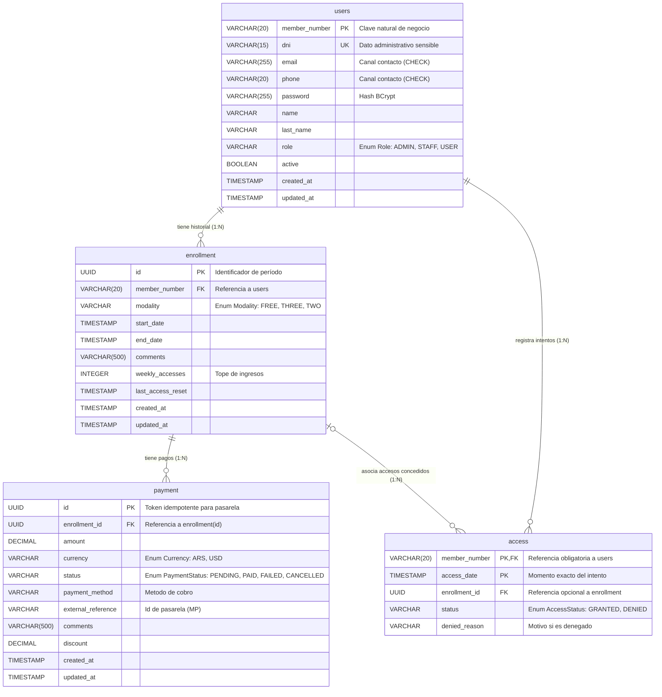

# Modelo de Datos — Entidades JPA (En construcción)

Documentación técnica completa del esquema de la base de datos. Este archivo contiene el detalle de cada entidad, sus atributos, las anotaciones JPA y las relaciones entre ellas. La versión resumida y orientada al uso está en el `README.md`.

## Stack

- **ORM:** Hibernate / JPA
- **Base de datos:** PostgreSQL
- **Creación de esquema:** script manual (archivo `schema.sql`).
- **Generación de claves:** `GenerationType.UUID`

## Diagrama de entidades



## Justificación de Claves

Para garantizar la solidez del modelo relacional y evitar el abuso de IDs artificiales, se aplicaron los siguientes criterios de selección de claves primarias:

| Entidad | ¿Posee Clave Natural Estable? | Naturaleza Conceptual | Tipo de PK Seleccionada | Justificación Académica y Operativa |
|---------|-------------------------------|-----------------------|-------------------------|-------------------------------------|
| `users` | Sí (`member_number`) | Fuerte / Negocio | Clave Natural (`member_number`) | Identidad real del socio, credencial física y tipeo en terminales. |
| `access`| Sí (`member_number` + `access_date`) | Evento temporal puntual | Clave Compuesta (`member_number`, `access_date`) | Evento puntual inmutable; evita proliferación de UUIDs por cada intento de acceso en la terminal. |
| `enrollment` | No (fechas mutables) | Período contractual dependiente | Subrogada (`UUID`) | Evita PKs compuestas mutables y cascadas sobre tablas dependientes. |
| `payment` | No (transaccional) | Transacción financiera | Subrogada (`UUID`) | Token idempotente para conciliación de webhooks y pasarelas de pago. |

## Relaciones

| Relación | Tipo | Descripción |
|----------|------|-------------|
| `User` ↔ `Enrollment` | `@OneToOne` (mapeado en `User`) | Cada usuario tiene como máximo una inscripción activa. `orphanRemoval = true`. |
| `Enrollment` ↔ `Payment` | `@OneToMany` (mapeado en `Enrollment`) | Una inscripción puede tener múltiples pagos. `orphanRemoval = true`. |
| `Enrollment` ↔ `Access` | `@OneToMany` (mapeado en `Enrollment`) | Una inscripción puede tener múltiples accesos registrados. `orphanRemoval = true`. |

---

## Entidad: `User`

Representa a un socio, personal o administrador del gimnasio.

**Nota de Escalabilidad (Credenciales opcionales):** Para la versión 1, los usuarios con rol `USER` (Socios) son dados de alta exclusivamente por el administrador y no poseen acceso al sistema, por lo que los campos `email` y `password` pueden ser nulos. La tabla se unifica para permitir a futuro habilitar credenciales sin reestructurar la base de datos (ej. un portal de autogestión de clientes).

```java
@Entity
@Table(name = "users")
public class User {

    @Id
    @GeneratedValue(strategy = GenerationType.UUID)
    private String id;

    @Column(unique = true, length = 255)
    private String email;

    @Column(length = 255)
    private String password;

    @Column(nullable = false)
    private String name;

    @Column(nullable = false)
    private String lastName;

    @Column(unique = true, nullable = false)
    private String dni;

    private LocalDateTime birthDate;

    @Column(length = 20)
    private String phone;

    @Enumerated(EnumType.STRING)
    @Column(nullable = false)
    private Role role = Role.USER;

    @Column(nullable = false)
    private boolean active = true;

    @CreationTimestamp
    @Column(name = "created_at", nullable = false, updatable = false)
    private LocalDateTime createdAt;

    @UpdateTimestamp
    @Column(name = "updated_at")
    private LocalDateTime updatedAt;

    @OneToOne(mappedBy = "user", cascade = CascadeType.ALL, orphanRemoval = true)
    private Enrollment enrollment;
}
```

### Tabla `users`

| Columna | Tipo | Nulos | Único | Observación |
|---------|------|-------|-------|-------------|
| `id` | UUID | No (generado) | — | Clave primaria |
| `email` | VARCHAR(255) | Sí | Sí | |
| `password` | VARCHAR(255) | Sí | — | Hash BCrypt |
| `name` | VARCHAR | No | — | |
| `lastName` | VARCHAR | No | — | |
| `dni` | VARCHAR | No | Sí | |
| `birth_date` | TIMESTAMP | Sí | — | |
| `phone` | VARCHAR(20) | Sí | — | |
| `role` | VARCHAR | No | — | Valor por defecto `USER` |
| `active` | BOOLEAN | No | — | Valor por defecto `true` |
| `created_at` | TIMESTAMP | No | — | Generado automáticamente |
| `updated_at` | TIMESTAMP | Sí | — | Actualizado automáticamente |

---

## Entidad: `Enrollment`

Representa la inscripción de un usuario a un plan, con su modalidad y vigencia.

```java
@Entity
@Table(name = "enrollment")
public class Enrollment {

    @Id
    @GeneratedValue(strategy = GenerationType.UUID)
    private String id;

    @Column(unique = true, nullable = false)
    private String userId;

    @ManyToOne(fetch = FetchType.LAZY)
    @JoinColumn(name = "user_id", nullable = false)
    private User user;

    @Enumerated(EnumType.STRING)
    private Modality modality;

    private LocalDateTime startDate;
    private LocalDateTime endDate;

    @Column(length = 500)
    private String comments;

    @Column(nullable = false)
    private int weeklyAccesses = 0;

    private LocalDateTime lastAccessReset;

    @CreationTimestamp
    @Column(name = "created_at", nullable = false, updatable = false)
    private LocalDateTime createdAt;

    @UpdateTimestamp
    @Column(name = "updated_at")
    private LocalDateTime updatedAt;

    @OneToMany(mappedBy = "enrollment", cascade = CascadeType.ALL, orphanRemoval = true)
    private List<Payment> payments = new ArrayList<>();

    @OneToMany(mappedBy = "enrollment", cascade = CascadeType.ALL, orphanRemoval = true)
    private List<Access> accesses = new ArrayList<>();
}
```

### Tabla `enrollment`

| Columna | Tipo | Nulos | Único | Observación |
|---------|------|-------|-------|-------------|
| `id` | UUID | No (generado) | — | Clave primaria |
| `user_id` | VARCHAR | No | Sí | FK a `users.id` |
| `modality` | VARCHAR | Sí | — | Valor de `Modality` |
| `start_date` | TIMESTAMP | Sí | — | |
| `end_date` | TIMESTAMP | Sí | — | |
| `comments` | VARCHAR(500) | Sí | — | |
| `weekly_accesses` | INTEGER | No | — | Valor por defecto `0` |
| `last_access_reset` | TIMESTAMP | Sí | — | |
| `created_at` | TIMESTAMP | No | — | Generado automáticamente |
| `updated_at` | TIMESTAMP | Sí | — | Actualizado automáticamente |

---

## Entidad: `Access`

Registra cada intento de ingreso validado en la terminal de acceso.

```java
@Entity
@Table(name = "access")
public class Access {

    @Id
    @GeneratedValue(strategy = GenerationType.UUID)
    private String id;

    @Column(nullable = false)
    private String enrollmentId;

    @ManyToOne(fetch = FetchType.LAZY)
    @JoinColumn(name = "enrollment_id", nullable = false)
    private Enrollment enrollment;

    @CreationTimestamp
    @Column(name = "access_date", nullable = false)
    private LocalDateTime accessDate;

    @Enumerated(EnumType.STRING)
    @Column(nullable = false)
    private AccessStatus status = AccessStatus.GRANTED;

    @Column(length = 500)
    private String deniedReason;
}
```

### Tabla `access`

| Columna | Tipo | Nulos | Único | Observación |
|---------|------|-------|-------|-------------|
| `id` | UUID | No (generado) | — | Clave primaria |
| `enrollment_id` | VARCHAR | No | — | FK a `enrollment.id` |
| `access_date` | TIMESTAMP | No | — | Generado automáticamente |
| `status` | VARCHAR | No | — | Valor por defecto `GRANTED` |
| `denied_reason` | VARCHAR(500) | Sí | — | |

---

## Entidad: `Payment`

Registra un pago asociado a una inscripción.

```java
@Entity
@Table(name = "payment")
public class Payment {

    @Id
    @GeneratedValue(strategy = GenerationType.UUID)
    private String id;

    @Column(nullable = false)
    private String enrollmentId;

    @ManyToOne(fetch = FetchType.LAZY)
    @JoinColumn(name = "enrollment_id", nullable = false)
    private Enrollment enrollment;

    @Enumerated(EnumType.STRING)
    @Column(nullable = false)
    private Modality modality = Modality.FREE;

    @Column(nullable = false, precision = 19, scale = 2)
    private BigDecimal amount;

    @Enumerated(EnumType.STRING)
    @Column(nullable = false)
    private Currency currency = Currency.ARS;

    @Column(name = "start_date", nullable = false)
    private LocalDateTime startDate;

    @Column(name = "end_date")
    private LocalDateTime endDate;

    @Column(length = 500)
    private String comments;

    @Column(precision = 19, scale = 2)
    private BigDecimal discount;

    @CreationTimestamp
    @Column(name = "created_at", nullable = false, updatable = false)
    private LocalDateTime createdAt;

    @UpdateTimestamp
    @Column(name = "updated_at")
    private LocalDateTime updatedAt;
}
```

### Tabla `payment`

| Columna | Tipo | Nulos | Único | Observación |
|---------|------|-------|-------|-------------|
| `id` | UUID | No (generado) | — | Clave primaria |
| `enrollment_id` | VARCHAR | No | — | FK a `enrollment.id` |
| `modality` | VARCHAR | No | — | Valor de `Modality` |
| `amount` | DECIMAL(19,2) | No | — | |
| `currency` | VARCHAR | No | — | Valor por defecto `ARS` |
| `start_date` | TIMESTAMP | No | — | |
| `end_date` | TIMESTAMP | Sí | — | |
| `comments` | VARCHAR(500) | Sí | — | |
| `discount` | DECIMAL(19,2) | Sí | — | |
| `created_at` | TIMESTAMP | No | — | Generado automáticamente |
| `updated_at` | TIMESTAMP | Sí | — | Actualizado automáticamente |

---

## Enums

### `Role`

```java
public enum Role {
    ADMIN,   // Personal con acceso total al panel administrativo
    STAFF,   // Personal operativo (instructores, recepcionistas)
    USER     // Socio / usuario (Sin acceso al sistema en V1. Reservado para escalabilidad futura)
}
```

### `Currency`

```java
public enum Currency {
    ARS,   // Peso argentino
    USD    // Dólar estadounidense
}
```

### `Modality`

```java
public enum Modality {
    FREE,     // Acceso ilimitado
    THREE,    // 3 accesos por semana
    TWO       // 2 accesos por semana
}
```

### `AccessStatus`

```java
public enum AccessStatus {
    GRANTED,   // Acceso permitido
    DENIED     // Acceso negado
}
```

## Fundamentos de Diseño Relacional

Para el modelado de esta base de datos, se aplicaron estrictos criterios de diseño relacional, priorizando el uso de claves naturales y compuestas sobre la asignación automática de identificadores subrogados, salvo en casos donde la mutabilidad o la integración externa lo requieran.

**1. Uso de Clave Natural frente a UUID en Usuarios (`users`)**

El "número de socio" es la identidad unívoca del cliente. Es el dato que el usuario digita en la terminal de acceso. Utilizar `member_number` como PK elimina la sobrecarga de mantener dos identificadores únicos concurrentes (un UUID artificial + el número de socio), simplificando drásticamente las consultas (JOIN) con las tablas dependientes.

**2. Criterio de Privacidad frente al DNI (Privacy by Design)**

Aunque el DNI es natural y único, identifica a la persona ante el Estado. Su exposición indebida en pantallas de terminales de acceso representa un riesgo de privacidad.
Por lo tanto, el DNI se aisló con una restricción `UNIQUE NOT NULL` como clave alternativa exclusivamente para fines administrativos (legajo, facturación), pero no participa como identificador relacional en las transacciones operativas diarias.

**3. Garantía de Canal de Contacto**

Para evitar el registro de "socios fantasmas" incontactables ante vencimientos, se implementó una restricción a nivel de motor de base de datos: `CONSTRAINT chk_user_contact CHECK (email IS NOT NULL OR phone IS NOT NULL)`. Esto garantiza al menos una vía de comunicación válida sin hacer obligatorias ambas.

**4. Clave Primaria Compuesta en Eventos Temporales (`access`)**

Un intento de acceso en la terminal no es una entidad independiente que requiera una clave artificial (UUID); es un evento temporal.
Su identidad unívoca natural está determinada por quién intentó pasar (`member_number`) y en qué instante exacto lo hizo (`access_date`). Al usar esta clave compuesta, el evento queda registrado de forma inmutable, permitiendo además auditar accesos denegados sin depender de una inscripción activa.

**5. Uso Justificado de UUID en Entidades Específicas**
*   **En `enrollment` (Mutabilidad):** Las fechas de inicio y fin de una suscripción son inherentemente mutables (suspensiones, vacaciones, prórrogas). Si usáramos una PK compuesta basada en fechas, cualquier modificación forzaría una cascada de actualizaciones compleja en tablas dependientes. El UUID provee una identidad inmutable que independiza el contrato de sus ajustes temporales.
*   **En `payment` (Idempotencia externa):** En la integración con pasarelas de pago externas (ej. Mercado Pago), el sistema debe despachar un identificador único atómico previo a la redirección. El UUID funciona como un token idempotente para conciliar la transacción mediante webhooks de forma segura, sin exponer datos sensibles del negocio.