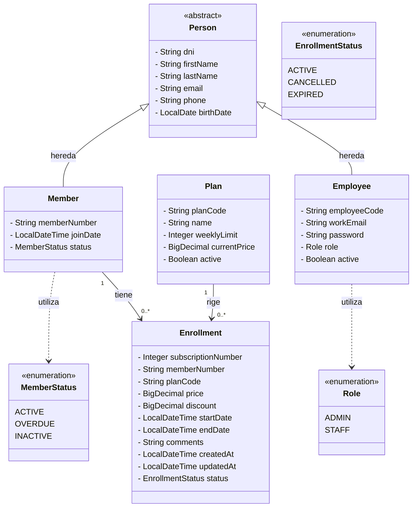
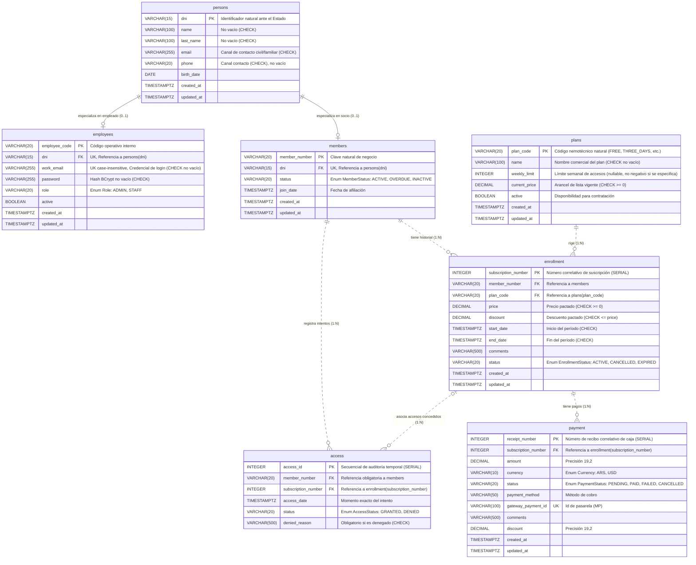

# Modelo de Datos del Dominio (Conceptual y Relacional)

Documentación técnica del modelo de datos del sistema, estructurada en dos niveles de abstracción:
1. **Modelo Conceptual de Dominio (UML):** Representación orientada a objetos de las clases de negocio, su jerarquía de herencia y atributos sin detalles de persistencia relacional.
2. **Modelo Relacional (DER):** Esquema físico en base de datos PostgreSQL, especificando tablas, claves primarias/foráneas, tipos de datos y restricciones.

---

## 1. Modelo Conceptual de Dominio (UML)

Diagrama de clases formal del dominio siguiendo las convenciones de tipos y visibilidad de Java:


```mermaid
classDiagram
    direction TB

    class Person {
        <<abstract>>
        - String dni
        - String firstName
        - String lastName
        - String email
        - String phone
        - LocalDate birthDate
    }

    class Member {
        - String memberNumber
        - LocalDateTime joinDate
        - MemberStatus status
    }

    class Employee {
        - String employeeCode
        - String workEmail
        - String password
        - Role role
        - Boolean active
    }

    class Plan {
        - String planCode
        - String name
        - Integer weeklyLimit
        - BigDecimal currentPrice
        - Boolean active
    }

    class Enrollment {
        - Integer subscriptionNumber
        - String memberNumber
        - String planCode
        - BigDecimal price
        - BigDecimal discount
        - LocalDateTime startDate
        - LocalDateTime endDate
        - String comments
        - LocalDateTime createdAt
        - LocalDateTime updatedAt
        - EnrollmentStatus status
    }

    class EnrollmentStatus {
        <<enumeration>>
        ACTIVE
        CANCELLED
        EXPIRED
    }
    class Role {
        <<enumeration>>
        ADMIN
        STAFF
    }

    class MemberStatus {
        <<enumeration>>
        ACTIVE
        OVERDUE
        INACTIVE
    }


    Person <|-- Member : hereda
    Person <|-- Employee : hereda
    Employee ..> Role : utiliza
    Member ..> MemberStatus : utiliza
    Member "1" --> "0..*" Enrollment : tiene
    Plan "1" --> "0..*" Enrollment : rige
```

### Justificación del Diseño Conceptual de Actores
* **Herencia `Person <|-- Member` y `Person <|-- Employee`:** Se desacoplan los roles y responsabilidades de los actores. Los empleados no son socios del gimnasio (no poseen `memberNumber` ni contratan suscripciones), y los socios no poseen credenciales de acceso al sistema administrativo (`password` ni `role`).
* **Seguridad y Privacidad:** Las credenciales de autenticación quedan estrictamente contenidas en `Employee`. `Member` solo expone atributos de membresía deportiva (`memberNumber`, `joinDate`, `status`).
* **Tipado:** Los atributos siguen las convenciones y tipos estándar de Java (`String`, `LocalDate`, `LocalDateTime`, tipos de enums), prescindiendo de tipos físicos de almacenamiento como `VARCHAR` o `TIMESTAMPTZ`.

---

## 2. Diagrama de Entidades (DER Relacional)


```mermaid
erDiagram
    persons {
        VARCHAR(15) dni PK "Identificador natural ante el Estado"
        VARCHAR(100) name "No vacío (CHECK)"
        VARCHAR(100) last_name "No vacío (CHECK)"
        VARCHAR(255) email "Canal de contacto civil/familiar (CHECK)"
        VARCHAR(20) phone "Canal contacto (CHECK), no vacío"
        DATE birth_date
        TIMESTAMPTZ created_at
        TIMESTAMPTZ updated_at
    }
    members {
        VARCHAR(20) member_number PK "Clave natural de negocio"
        VARCHAR(15) dni FK "UK, Referencia a persons(dni)"
        VARCHAR(20) status "Enum MemberStatus: ACTIVE, OVERDUE, INACTIVE"
        TIMESTAMPTZ join_date "Fecha de afiliación"
        TIMESTAMPTZ created_at
        TIMESTAMPTZ updated_at
    }
    employees {
        VARCHAR(20) employee_code PK "Código operativo interno"
        VARCHAR(15) dni FK "UK, Referencia a persons(dni)"
        VARCHAR(255) work_email "UK case-insensitive, Credencial de login (CHECK no vacío)"
        VARCHAR(255) password "Hash BCrypt no vacío (CHECK)"
        VARCHAR(20) role "Enum Role: ADMIN, STAFF"
        BOOLEAN active
        TIMESTAMPTZ created_at
        TIMESTAMPTZ updated_at
    }
    plans {
        VARCHAR(20) plan_code PK "Código nemotécnico natural (FREE, THREE_DAYS, etc.)"
        VARCHAR(100) name "Nombre comercial del plan (CHECK no vacío)"
        INTEGER weekly_limit "Límite semanal de accesos (nullable, no negativo si se especifica)"
        DECIMAL current_price "Arancel de lista vigente (CHECK >= 0)"
        BOOLEAN active "Disponibilidad para contratación"
        TIMESTAMPTZ created_at
        TIMESTAMPTZ updated_at
    }
    enrollment {
        INTEGER subscription_number PK "Número correlativo de suscripción (SERIAL)"
        VARCHAR(20) member_number FK "Referencia a members"
        VARCHAR(20) plan_code FK "Referencia a plans(plan_code)"
        DECIMAL price "Precio pactado (CHECK >= 0)"
        DECIMAL discount "Descuento pactado (CHECK <= price)"
        TIMESTAMPTZ start_date "Inicio del período (CHECK)"
        TIMESTAMPTZ end_date "Fin del período (CHECK)"
        VARCHAR(500) comments
        VARCHAR(20) status "Enum EnrollmentStatus: ACTIVE, CANCELLED, EXPIRED"
        TIMESTAMPTZ created_at
        TIMESTAMPTZ updated_at
    }
    payment {
        INTEGER receipt_number PK "Número de recibo correlativo de caja (SERIAL)"
        INTEGER subscription_number FK "Referencia a enrollment(subscription_number)"
        DECIMAL amount "Precisión 19,2"
        VARCHAR(10) currency "Enum Currency: ARS, USD"
        VARCHAR(20) status "Enum PaymentStatus: PENDING, PAID, FAILED, CANCELLED"
        VARCHAR(50) payment_method "Método de cobro"
        VARCHAR(100) gateway_payment_id UK "Id de pasarela (MP)"
        VARCHAR(500) comments
        DECIMAL discount "Precisión 19,2"
        TIMESTAMPTZ created_at
        TIMESTAMPTZ updated_at
    }
    access {
        INTEGER access_id PK "Secuencial de auditoría temporal (SERIAL)"
        VARCHAR(20) member_number FK "Referencia obligatoria a members"
        INTEGER subscription_number FK "Referencia a enrollment(subscription_number)"
        TIMESTAMPTZ access_date "Momento exacto del intento"
        VARCHAR(20) status "Enum AccessStatus: GRANTED, DENIED"
        VARCHAR(500) denied_reason "Obligatorio si es denegado (CHECK)"
    }
    persons ||--|o members : "especializa en socio (0..1)"
    persons ||--|o employees : "especializa en empleado (0..1)"
    plans ||..o{ enrollment : "rige (1:N)"
    members ||..o{ enrollment : "tiene historial (1:N)"
    members ||..o{ access : "registra intentos (1:N)"
    enrollment ||..o{ payment : "tiene pagos (1:N)"
    enrollment |o..o{ access : "asocia accesos concedidos (1:N)"
```

**Notación del diagrama:** la línea punteada representa una relación no identificadora (el hijo tiene su propia clave primaria y solo referencia al padre).
## Justificación de Claves

Para garantizar la solidez del modelo relacional y evitar el abuso de IDs artificiales, se aplicaron los siguientes criterios de selección de claves primarias:

| Entidad | ¿Posee Clave Natural Estable? | Naturaleza Conceptual | Tipo de PK Seleccionada | Justificación Académica y Operativa |
|---------|-------------------------------|-----------------------|-------------------------|-------------------------------------|
| `persons` | Sí (`dni`) | Fuerte / Natural | Clave Natural (`dni VARCHAR(15)`) | Identidad unívoca de la persona ante el Estado, asegura la unicidad física y canal de contacto de los datos personales. |
| `members` | Sí (`member_number`) | Fuerte / Negocio | Clave Natural (`member_number VARCHAR(20)`) | Identidad operativa del cliente, credencial física y tipeo en terminales; vincula a `persons(dni)` mediante clave foránea 1:1. |
| `plans` | Sí (`plan_code`) | Fuerte / Negocio | Clave Natural (`plan_code VARCHAR(20)`) | Código natural que identifica cada registro de Plan y sus datos comerciales; los valores citados en esta documentación son ejemplos, no una enumeración cerrada. |
| `access`| No (auditoría secuencial) | Evento temporal puntual | Secuencia Correlativa (`access_id SERIAL`) | Identificador secuencial de evento de auditoría de puerta; desacopla el evento y permite auditar intentos de forma independiente sin sobrecarga de identificadores artificiales ni colisiones. |
| `enrollment` | No (período contractual) | Período contractual dependiente | Secuencia Correlativa (`subscription_number SERIAL`) | Numeración correlativa de suscripción o contrato de mostrador; evita claves subrogadas artificiales y claves compuestas mutables. |
| `payment` | No (transaccional comercial) | Comprobante contable de caja | Secuencia Correlativa (`receipt_number SERIAL`) | Número de recibo correlativo de mostrador para trazabilidad comercial y contable (#00001, #00002). |

## Relaciones

| Relación | Tipo | Descripción |
|----------|------|-------------|
| `persons` ↔ `members` | `1:1` opcional (Joined Table) | Una persona física puede especializarse como socio activo del gimnasio. |
| `persons` ↔ `employees` | `1:1` opcional (Joined Table) | Una persona física puede especializarse como empleado (cajero/administrador). |
| `plans` ↔ `enrollment` | `1:N` (Uno a Muchos), no identificadora | Un plan o modalidad de arancel rige múltiples contrataciones de socios a lo largo del tiempo. |
| `members` ↔ `enrollment` | `1:N` (Uno a Muchos), no identificadora | Un socio puede tener múltiples inscripciones a lo largo del tiempo (historial por período). |
| `members` ↔ `access` | `1:N` (Uno a Muchos), no identificadora | Un socio puede registrar múltiples intentos de acceso (historial de accesos). |
| `enrollment` ↔ `payment` | `1:N` (Uno a Muchos), no identificadora | Una inscripción puede registrar múltiples pagos o intentos de cobro vinculados por `subscription_number`. |
| `enrollment` ↔ `access` | `1:N` (Uno a Muchos), no identificadora | Una inscripción asocia los accesos concedidos durante su vigencia a través de `subscription_number` (opcional; nulo si el acceso fue denegado sin inscripción activa). |

---

## Tabla: `persons`

Representa los datos físicos y de contacto de cualquier individuo registrado en el sistema (socio o empleado).

**Nota de Integridad y Contacto:** Centraliza la identidad legal de la persona (`dni`) y garantiza que no haya registros "fantasma" exigiendo al menos un medio de comunicación (`chk_person_contact`: email o teléfono obligatorios). El campo `email` actúa como canal de contacto civil y familiar (no es único, permitiendo que menores de edad o grupos familiares compartan el correo electrónico sin bloqueos). La búsqueda eficiente se optimiza mediante el índice no único `ix_persons_email`.

| Columna | Tipo | Nulos | Único | Observación |
|---------|------|-------|-------|-------------|
| `dni` | VARCHAR(15) | No | Sí (PK) | Clave primaria natural legal. No puede quedar vacío (CHECK) |
| `name` | VARCHAR(100) | No | — | Nombre(s). No puede quedar vacío (CHECK) |
| `last_name` | VARCHAR(100) | No | — | Apellido(s). No puede quedar vacío (CHECK) |
| `email` | VARCHAR(255)| Sí | — | Canal de contacto principal civil/familiar. Optimizado por `ix_persons_email` (no único, permite representación familiar) |
| `phone` | VARCHAR(20) | Sí | — | Canal de contacto alternativo. Si se carga, no puede quedar vacío |
| `birth_date` | DATE | Sí | — | Fecha de nacimiento |
| `created_at` | TIMESTAMPTZ | No | — | Por defecto `CURRENT_TIMESTAMP` |
| `updated_at` | TIMESTAMPTZ | Sí | — | Asignado por la aplicación al modificar datos de la persona |

---

## Tabla: `members`

Representa la especialización de una persona como cliente/socio del gimnasio.

**Nota de Privacidad y Negocio:** El socio opera en terminales y mostrador mediante su `member_number`, protegiendo el `dni` civil. Esta tabla no posee contraseñas ni roles administrativos, desacoplando completamente la membresía deportiva de la seguridad del sistema.

| Columna | Tipo | Nulos | Único | Observación |
|---------|------|-------|-------|-------------|
| `member_number` | VARCHAR(20) | No | Sí (PK) | Clave natural de negocio utilizada en terminales de acceso |
| `dni` | VARCHAR(15) | No | Sí (UK/FK) | Clave foránea 1:1 a `persons.dni` (`ON DELETE RESTRICT`) |
| `status` | VARCHAR(20) | No | — | Valor del Enum `MemberStatus` (`ACTIVE`, `OVERDUE`, `INACTIVE`) |
| `join_date` | TIMESTAMPTZ | No | — | Fecha y hora de alta de la membresía |
| `created_at` | TIMESTAMPTZ | No | — | Por defecto `CURRENT_TIMESTAMP` |
| `updated_at` | TIMESTAMPTZ | Sí | — | Asignado por la aplicación ante modificaciones |

---

## Tabla: `employees`

Representa la especialización de una persona como personal operativo o administrativo del gimnasio.

**Nota de Autenticación y Roles:** Centraliza exclusivamente las credenciales de acceso al sistema informático (`work_email` como identificador de login con restricción física de unicidad insensible a mayúsculas asegurada por el índice funcional `ux_employees_work_email`, y `password` encriptado con BCrypt) y el rol de seguridad asignado (`ADMIN`, `STAFF`). No contiene número de socio.

| Columna | Tipo | Nulos | Único | Observación |
|---------|------|-------|-------|-------------|
| `employee_code` | VARCHAR(20) | No | Sí (PK) | Identificador unívoco o legajo del empleado en el gimnasio |
| `dni` | VARCHAR(15) | No | Sí (UK/FK) | Clave foránea 1:1 a `persons.dni` (`ON DELETE RESTRICT`) |
| `work_email` | VARCHAR(255) | No | Sí (UK) | Correo electrónico laboral y credencial de login. Unicidad case-insensitive mediante `ux_employees_work_email` (`LOWER(work_email)`). Restricción CHECK: no vacío |
| `password` | VARCHAR(255)| No | — | Hash BCrypt obligatorio. No puede quedar vacío (CHECK) |
| `role` | VARCHAR(20) | No | — | Valor del Enum `Role` (`ADMIN`, `STAFF`, restricción CHECK) |
| `active` | BOOLEAN | No | — | Estado del usuario para control de login (por defecto `true`) |
| `created_at` | TIMESTAMPTZ | No | — | Por defecto `CURRENT_TIMESTAMP` |
| `updated_at` | TIMESTAMPTZ | Sí | — | Asignado por la aplicación ante modificaciones |
---

## Tabla: `plans`

Representa el catálogo de modalidades de acceso y aranceles vigentes del gimnasio (soporte de configuración de aranceles según Pantalla 5 de mockups).

**Nota de Aranceles Dinámicos e Inmutabilidad Histórica:** Centraliza los precios de lista y cupos semanales. Cuando un socio contrata una inscripción (`enrollment`), esta toma el precio de lista (`current_price`) y lo congela en su campo `price`. Las futuras modificaciones de aranceles en `plans` aplican solo a nuevas contrataciones, preservando la inmutabilidad de los contratos vigentes y finalizados.

**Nota de Modalidades ("Pase Libre" vs. Becados / Cortesías):**
- **Pase Libre (`'FREE'`):** El término *"Free Pass"* o *"Pase Libre"* en la industria de gimnasios representa acceso sin límite semanal de concurrencia (`weekly_limit = NULL`), pero constituye un servicio comercial arancelado (habitualmente el plan con el abono más alto).
- **Becas y Cortesías ($0):** Para otorgar membresías gratuitas o con descuento total (becas deportivas, convenios institucionales o pases de cortesía), no se crea un tipo especial ni se bypasséa la base de datos: se configura un registro de `Plan` con `current_price = 0.00` (garantizado por la restricción `current_price >= 0`, ej. `plan_code = 'SCHOLARSHIP'`, `name = "Pase Becado / Institucional"`). Esto genera una inscripción formal por $0.00 (`enrollment.price = 0.00`), pero **no genera ningún registro en la tabla `payment`** (la cual exige estrictamente `amount > 0` mediante `chk_payment_amount`). El saldo adeudado del socio resulta $0.00, quedando habilitado para el acceso regular sin comprobantes financieros ficticios en caja.

| Columna | Tipo | Nulos | Único | Observación |
|---------|------|-------|-------|-------------|
| `plan_code` | VARCHAR(20) | No | Sí (PK) | Código natural de negocio del Plan; los ejemplos `FREE`, `THREE_DAYS`, `TWO_DAYS` no constituyen un conjunto cerrado |
| `name` | VARCHAR(100) | No | — | Nombre comercial del plan. Restricción CHECK: no vacío |
| `weekly_limit` | INTEGER | Sí | — | Límite semanal de accesos. Restricción CHECK: `weekly_limit IS NULL OR weekly_limit >= 0` |
| `current_price` | DECIMAL(19,2) | No | — | Arancel de lista vigente. Restricción CHECK: `current_price >= 0` |
| `active` | BOOLEAN | No | — | Habilitación comercial para nuevas contrataciones (por defecto `TRUE`) |
| `created_at` | TIMESTAMPTZ | No | — | Por defecto `CURRENT_TIMESTAMP` |
| `updated_at` | TIMESTAMPTZ | Sí | — | Asignado por la aplicación ante modificaciones |
---

## Tabla: `enrollment`

Representa el período de inscripción de un socio vinculado al plan seleccionado (`plan_code`) y a sus fechas de vigencia.

**Nota de Vigencia:** cada inscripción es un período cerrado: siempre tiene fecha de inicio y de fin, y cada renovación genera una inscripción nueva. Una inscripción está vigente cuando `start_date <= momento < end_date`: el inicio se incluye y el fin no. Así, una renovación puede empezar en el mismo instante en que termina la anterior sin que se superpongan. La restricción `chk_enrollment_dates` exige que el fin sea posterior al inicio.

**Nota de Cupo Semanal:** la tabla no guarda un contador de accesos. El límite se define en el plan asociado mediante `plans.weekly_limit`; los accesos usados se cuentan en la tabla `access` (ver Fundamentos de Diseño Relacional, punto 7). La restricción CHECK requiere un valor no negativo cuando `weekly_limit` está informado.

**Nota de Condiciones Financieras:** `enrollment.price` conserva el precio pactado como snapshot histórico del `plans.current_price` aplicado al crear la inscripción; futuros cambios de tarifa no modifican ese valor. `discount` conserva el descuento concedido. Las restricciones `chk_enrollment_price` y `chk_enrollment_discount` exigen que el precio sea no negativo y que el descuento no supere dicho precio.

**Nota de Baja Lógica y Solapamiento:** la tabla implementa baja lógica mediante la columna `status` (`ACTIVE`, `CANCELLED`, `EXPIRED`). Para evitar inconsistencias operativas sin delegar la integridad exclusivamente a la aplicación, el motor de base de datos prohíbe el solapamiento de períodos vigentes para un mismo socio mediante una restricción de exclusión (`no_overlap_enrollment` vía `EXCLUDE USING gist`). Dicha restricción se aplica únicamente sobre inscripciones no canceladas (`WHERE status != 'CANCELLED'`), permitiendo registrar nuevas inscripciones sin conflictos si un período anterior fue dado de baja.

| Columna | Tipo | Nulos | Único | Observación |
|---------|------|-------|-------|-------------|
| `subscription_number` | SERIAL / INTEGER | No (generado) | Sí (PK) | Clave primaria. Número correlativo autoincremental de suscripción |
| `member_number` | VARCHAR(20) | No | — | FK a `members.member_number` (`ON DELETE RESTRICT`) |
| `plan_code` | VARCHAR(20) | No | — | FK a `plans.plan_code` (`ON DELETE RESTRICT`) |
| `price` | DECIMAL(19,2) | No | — | Precio pactado al suscribirse. Restricción CHECK: `price >= 0` |
| `discount` | DECIMAL(19,2) | Sí | — | Descuento aplicado al suscribirse. Restricción CHECK: `discount IS NULL OR (discount >= 0 AND discount <= price)` |
| `start_date` | TIMESTAMPTZ | No | — | Inicio del período (incluido). Restricción CHECK: anterior a `end_date` |
| `end_date` | TIMESTAMPTZ | No | — | Fin del período (excluido). Restricción CHECK: posterior a `start_date` |
| `comments` | VARCHAR(500) | Sí | — | |
| `status` | VARCHAR(20) | No | — | Valor del Enum `EnrollmentStatus` (Por defecto `ACTIVE`, restricción CHECK) |
| `created_at` | TIMESTAMPTZ | No | — | Por defecto `CURRENT_TIMESTAMP` |
| `updated_at` | TIMESTAMPTZ | Sí | — | Sin actualización automática en la base. La aplicación deberá asignarlo al modificar el registro |

---

## Tabla: `access`

Registra cada intento de ingreso validado en la terminal de acceso.

| Columna | Tipo | Nulos | Único | Observación |
| `access_id` | SERIAL / INTEGER | No (generado) | Sí (PK) | Clave primaria secuencial de auditoría temporal |
| `member_number` | VARCHAR(20) | No | — | FK a `members.member_number` (`ON DELETE RESTRICT`) |
| `subscription_number` | INTEGER | Sí | — | FK a `enrollment.subscription_number` (`ON DELETE RESTRICT`). Obligatorio si el acceso es `GRANTED`, opcional si es `DENIED` (`chk_access_logic`) |
| `access_date` | TIMESTAMPTZ | No | — | Momento exacto del intento. Por defecto `CURRENT_TIMESTAMP` |
| `status` | VARCHAR(20) | No | — | Valor del Enum `AccessStatus` (Sin valor por defecto, restricción CHECK) |
| `denied_reason` | VARCHAR(500) | Sí | — | Motivo del rechazo. Obligatorio si el acceso es `DENIED` (`chk_access_logic`) |

---

## Tabla: `payment`

Registra un pago asociado a una inscripción.

| Columna | Tipo | Nulos | Único | Observación |
|---------|------|-------|-------|-------------|
| `receipt_number` | SERIAL / INTEGER | No (generado) | Sí (PK) | Clave primaria. Número de recibo correlativo de caja |
| `subscription_number` | INTEGER | No | — | FK a `enrollment.subscription_number` (`ON DELETE RESTRICT`) |
| `amount` | DECIMAL(19,2) | No | — | Monto del pago. Restricción CHECK: `amount > 0` |
| `currency` | VARCHAR(10) | No | — | Valor Enum `Currency` (Por defecto `ARS`, restricción CHECK) |
| `status` | VARCHAR(20) | No | — | Valor del Enum `PaymentStatus` (Por defecto `PENDING`, restricción CHECK) |
| `payment_method` | VARCHAR(50) | Sí | — | Método de pago (ej. tarjeta, mercadopago) |
| `gateway_payment_id` | VARCHAR(100) | Sí | Sí (UK) | Id devuelto por la pasarela de pagos |
| `comments` | VARCHAR(500) | Sí | — | |
| `discount` | DECIMAL(19,2) | Sí | — | Descuento aplicado en el pago. Restricción CHECK: `discount IS NULL OR (discount >= 0 AND discount <= amount)` |
| `created_at` | TIMESTAMPTZ | No | — | Por defecto `CURRENT_TIMESTAMP` |
| `updated_at` | TIMESTAMPTZ | Sí | — | Sin actualización automática en la base. La aplicación deberá asignarlo al modificar el registro |

---

## Dominios de Valores (Enums)

Para garantizar la integridad de los datos a nivel conceptual, los siguientes campos operan bajo dominios de valores cerrados y están validados a nivel de motor de base de datos (`CHECK`):

### `Role` (Tabla `employees`)
- `ADMIN`: Personal con acceso total al panel administrativo y configuración del sistema.
- `STAFF`: Personal operativo (instructores, recepcionistas, cajeros).

### `MemberStatus` (Tabla `members`)
- `ACTIVE`: Socio con cuota y membresía al día; habilitado para acceder al gimnasio.
- `OVERDUE`: Socio con cuota pendiente o período vencido; acceso temporalmente denegado en molinete.
- `INACTIVE`: Socio dado de baja administrativa definitiva o suspendido.
### `Plan` como catálogo de datos, no como enum
La categoría fija `Modality` (`FREE`, `THREE`, `TWO`) fue reemplazada por la entidad relacional `plans`, identificada por `plan_code`. Los registros de Plan contienen `name`, `weekly_limit`, `current_price` y `active`. Los ejemplos de planes no constituyen un conjunto enumerado cerrado. Nótese que `'FREE'` denota "Pase Libre" (sin límite semanal de accesos, `weekly_limit IS NULL`), no gratuidad económica; la gratuidad se modela formalmente con `current_price = 0.00`.

### `EnrollmentStatus` (Tabla `enrollment`)
- `ACTIVE`: Inscripción activa y vigente en el sistema.
- `CANCELLED`: Inscripción cancelada / dada de baja lógica (libera el rango temporal para nuevas suscripciones y conserva pagos/accesos históricos).
- `EXPIRED`: Inscripción cuyo período de vigencia ha finalizado.

### `Currency` (Tabla `payment`)
- `ARS`: Peso argentino.
- `USD`: Dólar estadounidense.

### `PaymentStatus` (Tabla `payment`)
- `PENDING`: Pago pendiente de confirmación.
- `PAID`: Pago completado y acreditado.
- `FAILED`: Pago fallido o rechazado.
- `CANCELLED`: Pago cancelado para auditoría.

### `AccessStatus` (Tabla `access`)
- `GRANTED`: Acceso permitido.
- `DENIED`: Acceso denegado.

## Índices

PostgreSQL crea automáticamente un índice por cada clave primaria y por cada restricción `UNIQUE` (`persons.dni`, `members.member_number`, `members.dni`, `employees.employee_code`, `employees.dni`, `enrollment.subscription_number`, `payment.receipt_number`, `payment.gateway_payment_id` y `access.access_id`), y otro para la restricción de exclusión `no_overlap_enrollment`: un índice GiST sobre el socio y el rango de fechas de `enrollment`, sin las inscripciones canceladas (ver Fundamentos de Diseño Relacional, punto 9). Pero no indexa las claves foráneas ni expresiones funcionales. Por eso el esquema define los siguientes índices B-Tree:

| Índice | Tabla (columna) | Consultas que acelera |
|---|---|---|
| `ux_employees_work_email` | `employees` (`LOWER(work_email)`) | Garantiza la unicidad case-insensitive del correo laboral para autenticación (RF-01), evitando que variaciones de mayúsculas generen cuentas duplicadas. |
| `ix_persons_email` | `persons` (`LOWER(email)`), WHERE email IS NOT NULL | Búsqueda rápida por email de contacto civil/familiar (no impone unicidad para habilitar cuentas familiares y menores de edad). |
| `ix_enrollment_member_number` | `enrollment` (`member_number`) | Historial de inscripciones en la ficha del socio y búsqueda de la inscripción vigente en cada validación de acceso. También el control de `ON DELETE RESTRICT` al intentar borrar un socio. |
| `ix_enrollment_plan_code` | `enrollment` (`plan_code`) | Consultas de inscripciones por plan y control de integridad referencial `ON DELETE RESTRICT` al modificar planes. |
| `ix_payment_subscription_number` | `payment` (`subscription_number`) | Pagos de una inscripción al cobrar en caja y al controlar la cuota. También el control de `RESTRICT` al intentar borrar una inscripción. |
| `ix_access_subscription_number` | `access` (`subscription_number`) | Accesos habilitados por una inscripción (auditoría). También el control de `RESTRICT` al intentar borrar una inscripción. |
| `ix_access_access_date` | `access` (`access_date`) | Consultas por fecha sobre todos los socios: accesos del día, horarios pico del dashboard y filtros `from` / `to` de RF-17. |

## Fundamentos de Diseño Relacional

Para el modelado de esta base de datos, se aplicaron estrictos criterios de diseño relacional, priorizando el uso de claves naturales y compuestas sobre la asignación automática de identificadores subrogados, salvo en casos donde la mutabilidad o la integración externa lo requieran.

**1. Uso de Claves Naturales y Secuencias de Negocio frente a Identificadores Artificiales**

El "número de socio" es la identidad unívoca del cliente. Es el dato que el usuario digita en la terminal de acceso. Utilizar `member_number` como PK elimina la sobrecarga de mantener dos identificadores únicos concurrentes (un identificador artificial + el número de socio), simplificando drásticamente las consultas (JOIN) con las tablas dependientes.

**2. Criterio de Privacidad frente al DNI (Privacy by Design)**

Aunque el DNI es natural y único, identifica a la persona ante el Estado. Su exposición indebida en pantallas de terminales de acceso representa un riesgo de privacidad.
En el diseño normalizado mediante *Joined Table*, el DNI identifica naturalmente a la entidad física `persons(dni)` como clave primaria. Sin embargo, para salvaguardar la privacidad en el salón y terminales de autoservicio, la entidad `members` expone `member_number` como clave primaria de negocio, evitando que el DNI sea manipulado o visualizado en terminales de acceso.

**3. Garantía de Canal de Contacto**

Para evitar el registro de "personas fantasmas" incontactables ante vencimientos, se implementó una restricción a nivel de motor de base de datos en la tabla base: `CONSTRAINT chk_person_contact CHECK (email IS NOT NULL OR phone IS NOT NULL)`. Esto garantiza que se registre al menos un dato de contacto, sin hacer obligatorios ambos. La restricción comprueba que el dato exista, no que sea válido: un valor mal escrito la cumple igual (los vacíos los rechazan `chk_person_email` y `chk_person_phone`), por lo que el formato del email y del teléfono lo valida la aplicación al dar de alta al individuo.

**4. Identificador Secuencial en Eventos Temporales de Auditoría (`access`)**

Un intento de acceso en la terminal es un evento temporal de auditoría. Se identifica mediante una secuencia correlativa de auditoría (`access_id SERIAL`), lo que independiza la identidad del registro de los datos ingresados y permite registrar eventos con precisión temporal sin colisiones ni sobrecarga de identificadores artificiales. La inmutabilidad del registro la asegura la aplicación, que no expone operaciones de modificación ni de borrado (Módulo Access, regla 2).

**5. Identificadores Correlativos de Mostrador frente a Identificadores Artificiales (`subscription_number` y `receipt_number`)**
*   **En `enrollment` (Correlativo de Suscripción):** En el funcionamiento real de un gimnasio, los contratos o inscripciones no son identificados por cadenas hexadecimales abstractas. Se utiliza un número correlativo humano (`subscription_number SERIAL`) que proporciona una identidad inmutable para el contrato y sus extensiones sin requerir identificadores artificiales complejos ni PKs compuestas mutables basadas en fechas.
*   **En `payment` (Recibo Comercial):** Todo cobro en mostrador genera un comprobante o recibo con numeración correlativa (`receipt_number SERIAL`), facilitando la rendición de caja y el entendimiento para el cliente. Para la integración con pasarelas de pago externas (ej. Mercado Pago), el id de transacción que devuelve la pasarela se guarda en `gateway_payment_id`, que es `UNIQUE`: la base no permite registrar dos veces el mismo pago de Mercado Pago. Además, como un pago `PAID` no se modifica (regla 2 del módulo Payment), una notificación repetida no cambia un pago ya acreditado.
*   **Eliminación Total de Identificadores Artificiales Abstractos:** Se prescinde por completo de identificadores artificiales abstractos (como identificadores aleatorios opacos) en el modelo de datos del gimnasio, alineándose con las buenas prácticas de diseño conceptual y relacional donde priman claves naturales y correlativas legibles.
**6. Conservación del Historial (`ON DELETE RESTRICT`)**

Todas las claves foráneas del esquema se declaran con `ON DELETE RESTRICT`: el motor rechaza la eliminación de una persona, un socio o una inscripción mientras existan registros dependientes que los referencien. De este modo, un borrado accidental no puede arrastrar comprobantes de pago ni eventos de acceso, que las reglas de negocio definen como registros de auditoría. Las bajas se resuelven de forma lógica (`members.status = 'INACTIVE'`, `employees.active = FALSE`), sin eliminación física.
No se utiliza `ON DELETE SET NULL` en `access`: `member_number` es la referencia obligatoria al socio y `subscription_number` es la referencia que permite auditar qué inscripción habilitó cada acceso concedido.
El alcance de esta restricción es proteger a los registros padre: no impide eliminar directamente una fila de `payment` o de `access`. La aplicación deberá impedir el borrado de pagos y la modificación o eliminación de accesos (Módulo Payment, regla 2; Módulo Access, regla 2). Los pagos acreditados conservarán sus datos financieros y podrán pasar a `CANCELLED` según la regla de negocio definida.

**7. Cupo Semanal Calculado, no Almacenado**

Los accesos que un socio ya usó en la semana no se guardan en una columna: se obtienen contando sus accesos `GRANTED` en la tabla `access` desde el lunes a las 00:00 de la semana en curso. El límite aplicable se consulta en `plans.weekly_limit` a través del `plan_code` de la inscripción vigente. La restricción CHECK requiere un valor no negativo cuando el límite está informado.
Guardar un contador en `enrollment` implicaba repetir un dato que ya existe en `access`, con el riesgo de que ambos dejen de coincidir si falla la actualización de uno de ellos. También exigía una columna con la fecha del último reinicio, nula hasta el primer lunes, y un proceso que reiniciara el contador cada semana. Con el conteo, `access` es la única fuente del dato y no queda ningún campo que mantener.
El conteo se hace por socio y no por inscripción: si un socio renueva a mitad de semana, los accesos que ya usó esa semana siguen contando.

**8. Fechas con Zona Horaria (`TIMESTAMPTZ`)**

Todas las columnas de fecha y hora se declaran `TIMESTAMPTZ` (`timestamp with time zone`). PostgreSQL guarda cada valor como un instante absoluto (en UTC) y lo muestra convertido a la zona horaria de la sesión, de modo que un acceso representa el mismo momento sin importar desde dónde se consulte. `birth_date` se mantiene como `DATE`, porque una fecha de nacimiento no es un instante.
Con `TIMESTAMP` (sin zona), la base guarda la fecha y la hora tal como llegan, sin saber a qué zona corresponden. El backend se desplegará en Render y la base en Neon, que por defecto trabajan en UTC, mientras que el gimnasio opera en hora de Argentina (UTC−3). Un acceso del domingo a las 22:30 en el gimnasio es el lunes a la 01:30 en UTC: guardado sin zona, el mismo registro podría interpretarse en un día distinto según quién lo lea, y los horarios pico del dashboard aparecerían corridos tres horas.
Las reglas que dependen del día o de la semana se evalúan en la zona horaria del gimnasio. Para el cupo semanal (punto 7), el inicio de la semana se calcula como `date_trunc('week', now(), 'America/Argentina/Buenos_Aires')`: calculado en UTC, el acceso del domingo a las 22:30 se contaría en la semana siguiente.

**9. Prevención de Solapamiento Temporal y Baja Lógica (`enrollment`)**

Para garantizar que un socio no posea simultáneamente dos períodos de suscripción activos o superpuestos en el tiempo, el esquema implementa una restricción de exclusión a nivel de motor:
`CONSTRAINT no_overlap_enrollment EXCLUDE USING gist (member_number WITH =, tstzrange(start_date, end_date, '[)') WITH &&) WHERE (status != 'CANCELLED')`.

- **Uso de `btree_gist`:** PostgreSQL no admite de forma nativa la combinación de tipos escalares (como `VARCHAR` en `member_number` con el operador `=`) junto con rangos geométricos o temporales dentro de un índice GiST. La extensión `btree_gist` habilita esta compatibilidad, permitiendo evaluar la igualdad de socio y el solapamiento de rangos en un único índice eficiente.
- **Rango semiabierto `[)`:** El rango temporal `tstzrange(start_date, end_date, '[)')` incluye el instante de inicio (`start_date`) y excluye el de finalización (`end_date`). Esta formulación matemática modela con precisión la regla de vigencia del gimnasio, permitiendo que una renovación inicie exactamente en el mismo instante en que expira el período previo sin generar colisiones ni falsos positivos de solapamiento.
- **Baja Lógica y Conservación Histórica (RF-11):** La eliminación física mediante `DELETE` vulneraría la integridad referencial (`ON DELETE RESTRICT`) si la membresía ya cuenta con pagos registrados (`payment`) o ingresos en terminal (`access`). Para preservar la inmutabilidad y trazabilidad de estos registros contables y de auditoría, las cancelaciones se resuelven actualizando el estado a `CANCELLED`. Gracias al predicado parcial `WHERE (status != 'CANCELLED')`, al cancelar una inscripción futura o anticipada, el rango temporal queda inmediatamente liberado para registrar una nueva suscripción sin bloqueos.

**10. Segregación Semántica de Correos y Unicidad Funcional (`work_email`)**

El esquema desacopla conceptualmente la comunicación civil y familiar de la seguridad del sistema:
- **`persons.email` (Canal de Contacto Civil/Familiar):** No impone restricción de unicidad para permitir que menores de edad o grupos familiares compartan una misma dirección de contacto con sus tutores. Se optimiza para búsquedas mediante el índice no único `ix_persons_email`.
- **`employees.work_email` (Credencial de Acceso Corporativa):** Como credencial de autenticación del personal administrativo y operativo, exige unicidad física estricta. Dado que la cláusula `UNIQUE` estándar en SQL compara cadenas distinguiendo mayúsculas (*case-sensitive*, lo que permitiría crear por error cuentas duplicadas como `admin@gym.com` y `Admin@gym.com`), la unicidad física se implementa mediante el índice funcional único:
  ```sql
  CREATE UNIQUE INDEX IF NOT EXISTS ux_employees_work_email ON employees (LOWER(work_email));
  ```
  Esto asegura a nivel de motor de base de datos que no existan credenciales duplicadas por diferencias de tipeo y optimiza la autenticación en el endpoint `/api/auth/login` (RF-01).

