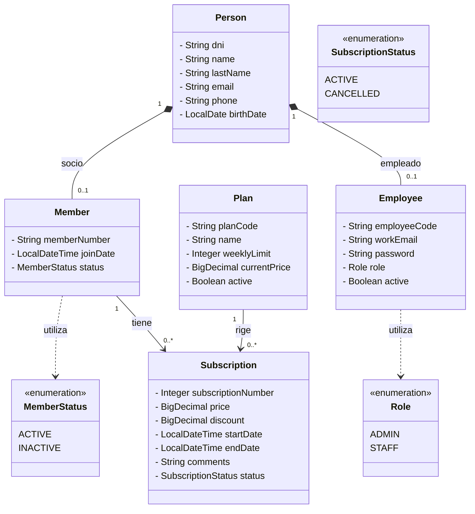

# Modelo de Datos del Dominio (Conceptual y Relacional)

Documentación técnica del modelo de datos del sistema, estructurada en dos niveles de abstracción:
1. **Modelo Conceptual de Dominio (UML):** Representación orientada a objetos de las clases de negocio, sus relaciones y atributos sin detalles de persistencia relacional.
2. **Modelo Relacional (DER):** Esquema físico en base de datos PostgreSQL, especificando tablas, claves primarias/foráneas, tipos de datos y restricciones.

---

## 1. Modelo Conceptual de Dominio (UML)

Diagrama de clases formal del dominio siguiendo las convenciones de tipos y visibilidad de Java:


```mermaid
classDiagram
    direction TB

    class Person {
        - String dni
        - String name
        - String lastName
        - String email
        - String phone
        - LocalDate birthDate
    }

    class Member {
        - String memberNumber
        - LocalDateTime joinDate
        - MemberStatus status
    }

    class Employee {
        - String employeeCode
        - String workEmail
        - String password
        - Role role
        - Boolean active
    }

    class Plan {
        - String planCode
        - String name
        - Integer weeklyLimit
        - BigDecimal currentPrice
        - Boolean active
    }

    class Subscription {
        - Integer subscriptionNumber
        - BigDecimal price
        - BigDecimal discount
        - LocalDateTime startDate
        - LocalDateTime endDate
        - String comments
        - SubscriptionStatus status
    }

    class SubscriptionStatus {
        <<enumeration>>
        ACTIVE
        CANCELLED
    }
    class Role {
        <<enumeration>>
        ADMIN
        STAFF
    }

    class MemberStatus {
        <<enumeration>>
        ACTIVE
        INACTIVE
    }


    Person "1" *-- "0..1" Member : socio
    Person "1" *-- "0..1" Employee : empleado
    Employee ..> Role : utiliza
    Member ..> MemberStatus : utiliza
    Member "1" --> "0..*" Subscription : tiene
    Plan "1" --> "0..*" Subscription : rige
```

### Justificación del Diseño Conceptual de Actores
* **Socio y empleado como roles de una persona:** `Person` guarda los datos de cualquier persona y `Member` y `Employee` son roles que puede tener o no. Una persona puede tener uno, el otro o los dos, por ejemplo la profe que también entrena en el gimnasio, y puede sumar o dejar un rol con el tiempo sin dejar de ser la misma persona. Por eso no se usa herencia: la herencia es fija y un cambio de rol obligaría a cambiar de clase. Se dibuja como composición porque el rol se crea para una persona y no existe sin ella.
* **Seguridad y Privacidad:** Las credenciales de autenticación quedan estrictamente contenidas en `Employee`. `Member` solo expone atributos de membresía deportiva (`memberNumber`, `joinDate`, `status`).
* **Relaciones como líneas, no como atributos:** `Subscription` no lleva `memberNumber` ni `planCode` porque a qué socio y a qué plan pertenece ya lo muestran las líneas `tiene` y `rige`. Las claves foráneas y las fechas de registro (`created_at`, `updated_at`) son detalles de las tablas y aparecen en el DER.
* **Tipado:** Los atributos siguen las convenciones y tipos estándar de Java (`String`, `LocalDate`, `LocalDateTime`, tipos de enums), prescindiendo de tipos físicos de almacenamiento como `VARCHAR` o `TIMESTAMPTZ`.

---

## 2. Diagrama de Entidades (DER Relacional)

```mermaid
erDiagram
    persons {
        VARCHAR(15) dni PK "Identificador natural ante el Estado"
        VARCHAR(100) name "No vacío (CHECK)"
        VARCHAR(100) last_name "No vacío (CHECK)"
        VARCHAR(255) email "Canal de contacto civil/familiar (CHECK)"
        VARCHAR(20) phone "Canal contacto (CHECK), no vacío"
        DATE birth_date
        TIMESTAMPTZ created_at
        TIMESTAMPTZ updated_at
    }
    members {
        VARCHAR(20) member_number PK "Clave natural de negocio"
        VARCHAR(15) dni FK "UK, Referencia a persons(dni)"
        VARCHAR(20) status "Enum MemberStatus: ACTIVE, INACTIVE"
        TIMESTAMPTZ join_date "Fecha de afiliación"
        TIMESTAMPTZ created_at
        TIMESTAMPTZ updated_at
    }
    employees {
        VARCHAR(20) employee_code PK "Código operativo interno"
        VARCHAR(15) dni FK "UK, Referencia a persons(dni)"
        VARCHAR(255) work_email "UK case-insensitive, Credencial de login (CHECK no vacío)"
        VARCHAR(255) password "Hash BCrypt no vacío (CHECK)"
        VARCHAR(20) role "Enum Role: ADMIN, STAFF"
        BOOLEAN active
        TIMESTAMPTZ created_at
        TIMESTAMPTZ updated_at
    }
    plans {
        VARCHAR(20) plan_code PK "Código nemotécnico natural (FREE, THREE_DAYS, etc.)"
        VARCHAR(100) name "Nombre comercial del plan (CHECK no vacío)"
        INTEGER weekly_limit "Límite semanal de accesos (nullable, no negativo si se especifica)"
        DECIMAL(19,2) current_price "Arancel de lista vigente (CHECK >= 0)"
        BOOLEAN active "Disponibilidad para contratación"
        TIMESTAMPTZ created_at
        TIMESTAMPTZ updated_at
    }
    subscriptions {
        INTEGER subscription_number PK "Número correlativo de suscripción (SERIAL)"
        VARCHAR(20) member_number FK "Referencia a members"
        VARCHAR(20) plan_code FK "Referencia a plans(plan_code)"
        DECIMAL(19,2) price "Precio pactado (CHECK >= 0)"
        DECIMAL(19,2) discount "Descuento pactado (CHECK <= price)"
        TIMESTAMPTZ start_date "Inicio del período (CHECK)"
        TIMESTAMPTZ end_date "Fin del período (CHECK)"
        VARCHAR(500) comments
        VARCHAR(20) status "Enum SubscriptionStatus: ACTIVE, CANCELLED"
        TIMESTAMPTZ created_at
        TIMESTAMPTZ updated_at
    }
    payment {
        INTEGER receipt_number PK "Número de recibo correlativo de caja (SERIAL)"
        INTEGER subscription_number FK "Referencia a subscriptions(subscription_number)"
        VARCHAR(20) employee_code FK "Referencia a employees(employee_code); vacío solo en Mercado Pago"
        DECIMAL(19,2) amount "Importe cobrado en pesos (CHECK > 0)"
        VARCHAR(20) status "Enum PaymentStatus: PENDING, PAID, FAILED, CANCELLED"
        VARCHAR(50) payment_method "Enum PaymentMethod: CASH, MERCADO_PAGO"
        VARCHAR(100) gateway_payment_id UK "Id de pasarela (MP)"
        VARCHAR(500) comments
        TIMESTAMPTZ created_at
        TIMESTAMPTZ updated_at
    }
    access_logs {
        INTEGER access_id PK "Secuencial de auditoría temporal (SERIAL)"
        VARCHAR(20) entered_member_number "Número tipeado en la terminal (CHECK no vacío)"
        VARCHAR(20) member_number FK "Referencia a members; nulo si el número no existe"
        INTEGER subscription_number FK "Suscripción que habilitó el ingreso; obligatoria si es concedido"
        TIMESTAMPTZ access_time "Momento exacto del intento"
        VARCHAR(20) status "Enum AccessStatus: GRANTED, DENIED"
        VARCHAR(30) denied_reason "Enum DeniedReason; obligatorio si es denegado (CHECK)"
    }
    persons ||--|o members : "rol de socio (0..1)"
    persons ||--|o employees : "rol de empleado (0..1)"
    plans ||..o{ subscriptions : "rige (1:N)"
    members ||..o{ subscriptions : "tiene historial (1:N)"
    members |o..o{ access_logs : "registra intentos (1:N)"
    subscriptions ||..o{ payment : "tiene pagos (1:N)"
    employees |o..o{ payment : "cobra (1:N)"
    subscriptions |o..o{ access_logs : "habilita ingresos (1:N)"
```

**Notación del diagrama:** la línea punteada representa una relación no identificadora (el hijo tiene su propia clave primaria y solo referencia al padre).
## Justificación de Claves

Cada clave primaria se eligió según cómo identifica el gimnasio a esa cosa en la práctica. No se usan UUID. Hay dos casos:

- **Clave natural:** el dato ya existe en el negocio y no se repite (DNI, número de socio, código de empleado, código de plan).
- **Número correlativo (`SERIAL`):** para suscripciones, cobros e ingresos no hay un dato propio que los identifique, así que la base los numera 1, 2, 3... Es una clave sustituta (el equivalente del `AUTO_INCREMENT` de MySQL), pero tiene un uso en el negocio: es el número con el que se nombra esa suscripción, ese recibo o ese ingreso.

| Tabla | Clave primaria | Tipo de clave | Por qué |
|-------|----------------|---------------|---------|
| `persons` | `dni VARCHAR(15)` | Natural | Es el documento con el que se identifica a cualquier persona y no se repite. |
| `members` | `member_number VARCHAR(20)` | Natural del negocio | Es el número que el socio da en recepción y escribe en la terminal. El DNI queda como clave foránea única hacia `persons`. |
| `employees` | `employee_code VARCHAR(20)` | Natural del negocio | Es el código o legajo interno del empleado. El DNI queda como clave foránea única hacia `persons` y el login se hace con `work_email`. |
| `plans` | `plan_code VARCHAR(20)` | Natural del negocio | Es el código corto de cada plan (por ejemplo `THREE_DAYS`); los valores citados son ejemplos, no una lista cerrada. |
| `subscriptions` | `subscription_number SERIAL` | Correlativo (sustituta) | Un socio tiene muchas suscripciones a lo largo del tiempo. Socio + fecha de inicio no alcanza como clave, porque una suscripción cancelada y la que la reemplaza pueden empezar el mismo día. El número permite hablar de "la suscripción 1520" en caja. |
| `payment` | `receipt_number SERIAL` | Correlativo (sustituta) | Funciona como el número de recibo del talonario de caja. |
| `access_logs` | `access_id SERIAL` | Correlativo (sustituta) | Cada intento en la terminal es un evento. El socio y la hora no alcanzan como clave, porque dos intentos pueden registrarse con la misma hora. |

El número correlativo lo genera la base y puede tener saltos (por ejemplo, si una operación falla antes de guardarse). Sirve para identificar el registro, pero no es una numeración fiscal.

## Relaciones

| Relación | Tipo | Descripción |
|----------|------|-------------|
| `persons` ↔ `members` | `1:1` opcional | Una persona puede tener el rol de socio del gimnasio. |
| `persons` ↔ `employees` | `1:1` opcional | Una persona puede tener el rol de empleado (cajero/administrador), incluso si también es socia. |
| `plans` ↔ `subscriptions` | `1:N` (Uno a Muchos), no identificadora | Un plan o modalidad de arancel rige múltiples contrataciones de socios a lo largo del tiempo. |
| `members` ↔ `subscriptions` | `1:N` (Uno a Muchos), no identificadora | Un socio puede tener múltiples suscripciones a lo largo del tiempo (historial por período). |
| `members` ↔ `access_logs` | `1:N` (Uno a Muchos), no identificadora | Un socio puede registrar múltiples intentos de acceso (historial de accesos). La referencia es opcional: un intento con un número que no existe se guarda sin socio. |
| `subscriptions` ↔ `payment` | `1:N` (Uno a Muchos), no identificadora | Una suscripción puede registrar múltiples pagos o intentos de cobro vinculados por `subscription_number`. |
| `subscriptions` ↔ `access_logs` | `1:N` (Uno a Muchos), no identificadora | Cada ingreso concedido guarda la suscripción que lo habilitó (`subscription_number`, obligatoria si es `GRANTED`). En un rechazo es opcional: se carga si ayuda a explicarlo, por ejemplo con cuota impaga. |
| `employees` ↔ `payment` | `1:N` (Uno a Muchos), no identificadora | Un empleado puede cobrar muchos pagos en caja. El pago guarda quién lo cobró en `employee_code` (opcional). Todo cobro en el mostrador lo guarda, también si se paga con el QR de Mercado Pago; solo queda vacío en un pago de Mercado Pago que el socio hace por su cuenta, sin pasar por caja. |

---

## Tabla: `persons`

Representa los datos físicos y de contacto de cualquier individuo registrado en el sistema (socio o empleado).

**Nota de Integridad y Contacto:** Centraliza la identidad legal de la persona (`dni`) y garantiza que no haya registros "fantasma" exigiendo al menos un medio de comunicación (`chk_person_contact`: email o teléfono obligatorios). El campo `email` actúa como canal de contacto civil y familiar (no es único, permitiendo que menores de edad o grupos familiares compartan el correo electrónico sin bloqueos). La búsqueda eficiente se optimiza mediante el índice no único `ix_persons_email`.

| Columna | Tipo | Nulos | Único | Observación |
|---------|------|-------|-------|-------------|
| `dni` | VARCHAR(15) | No | Sí (PK) | Clave primaria natural legal. No puede quedar vacío (CHECK) |
| `name` | VARCHAR(100) | No | — | Nombre(s). No puede quedar vacío (CHECK) |
| `last_name` | VARCHAR(100) | No | — | Apellido(s). No puede quedar vacío (CHECK) |
| `email` | VARCHAR(255)| Sí | — | Canal de contacto principal civil/familiar. Optimizado por `ix_persons_email` (no único, permite representación familiar). Si se carga, no puede quedar vacío |
| `phone` | VARCHAR(20) | Sí | — | Canal de contacto alternativo. Si se carga, no puede quedar vacío |
| `birth_date` | DATE | Sí | — | Fecha de nacimiento |
| `created_at` | TIMESTAMPTZ | No | — | Por defecto `CURRENT_TIMESTAMP` |
| `updated_at` | TIMESTAMPTZ | Sí | — | Asignado por la aplicación al modificar datos de la persona |

---

## Tabla: `members`

Representa el rol de socio de una persona en el gimnasio.

**Nota de Privacidad y Negocio:** El socio opera en terminales y mostrador mediante su `member_number`, protegiendo el `dni` civil. Esta tabla no posee contraseñas ni roles administrativos, desacoplando completamente la membresía deportiva de la seguridad del sistema.

**Nota de Preservación del Socio ante Vencimiento:** El vencimiento de una suscripción no genera ninguna mutación automática ni eliminación sobre el registro de la entidad `Member` ni modifica su `status`. La vigencia de la suscripción y la deuda exigible se evalúan dinámicamente al validar el acceso (RF-16), según la suscripción y sus pagos, preservando intacto el historial de auditoría del socio.

| Columna | Tipo | Nulos | Único | Observación |
|---------|------|-------|-------|-------------|
| `member_number` | VARCHAR(20) | No | Sí (PK) | Clave natural de negocio utilizada en terminales de acceso. No puede quedar vacío (CHECK) |
| `dni` | VARCHAR(15) | No | Sí (UK/FK) | Clave foránea 1:1 a `persons.dni` (`ON DELETE RESTRICT`) |
| `status` | VARCHAR(20) | No | — | Valor del Enum `MemberStatus` (por defecto `ACTIVE`; permite `ACTIVE`, `INACTIVE`) |
| `join_date` | TIMESTAMPTZ | No | — | Fecha y hora de alta de la membresía. Por defecto `CURRENT_TIMESTAMP` |
| `created_at` | TIMESTAMPTZ | No | — | Por defecto `CURRENT_TIMESTAMP` |
| `updated_at` | TIMESTAMPTZ | Sí | — | Asignado por la aplicación ante modificaciones |

---

## Tabla: `employees`

Representa el rol de empleado de una persona, como personal operativo o administrativo del gimnasio.

**Nota de Autenticación y Roles:** Centraliza exclusivamente las credenciales de acceso al sistema informático (`work_email` como identificador de login con restricción física de unicidad insensible a mayúsculas asegurada por el índice funcional `ux_employees_work_email`, y `password` encriptado con BCrypt) y el rol de seguridad asignado (`ADMIN`, `STAFF`). No contiene número de socio.

| Columna | Tipo | Nulos | Único | Observación |
|---------|------|-------|-------|-------------|
| `employee_code` | VARCHAR(20) | No | Sí (PK) | Identificador unívoco o legajo del empleado en el gimnasio. No puede quedar vacío (CHECK) |
| `dni` | VARCHAR(15) | No | Sí (UK/FK) | Clave foránea 1:1 a `persons.dni` (`ON DELETE RESTRICT`) |
| `work_email` | VARCHAR(255) | No | Sí (UK) | Correo electrónico laboral y credencial de login. Unicidad case-insensitive mediante `ux_employees_work_email` (`LOWER(work_email)`). Restricción CHECK: no vacío |
| `password` | VARCHAR(255)| No | — | Hash BCrypt obligatorio. No puede quedar vacío (CHECK) |
| `role` | VARCHAR(20) | No | — | Valor del Enum `Role` (`ADMIN`, `STAFF`, restricción CHECK) |
| `active` | BOOLEAN | No | — | Estado del usuario para control de login (por defecto `true`) |
| `created_at` | TIMESTAMPTZ | No | — | Por defecto `CURRENT_TIMESTAMP` |
| `updated_at` | TIMESTAMPTZ | Sí | — | Asignado por la aplicación ante modificaciones |
---

## Tabla: `plans`

Representa el catálogo de modalidades de acceso y aranceles vigentes del gimnasio (soporte de configuración de aranceles según Pantalla 5 de mockups).

**Nota de Aranceles Dinámicos e Inmutabilidad Histórica:** Centraliza los precios de lista y cupos semanales. Cuando un socio contrata una suscripción (`subscriptions`), esta toma el precio de lista (`current_price`) y lo congela en su campo `price`. Las futuras modificaciones de aranceles en `plans` aplican solo a nuevas contrataciones, preservando la inmutabilidad de los contratos vigentes y finalizados.

**Nota de Modalidades ("Pase Libre" vs. Becados / Cortesías):**
- **Pase Libre (`'FREE'`):** El término *"Free Pass"* o *"Pase Libre"* en la industria de gimnasios representa acceso sin límite semanal de concurrencia (`weekly_limit = NULL`), pero constituye un servicio comercial arancelado (habitualmente el plan con el abono más alto).
- **Becas y Cortesías ($0) y Bonificaciones al 100% (AC4):** Para otorgar membresías gratuitas o con descuento total (becas deportivas, convenios institucionales o pases de cortesía), no se crea un tipo especial ni se saltea la base de datos: puede configurarse un registro de `Plan` con `current_price = 0.00` (garantizado por la restricción `current_price >= 0`, ej. `plan_code = 'SCHOLARSHIP'`, `name = "Pase Becado / Institucional"`), o bien aplicarse una bonificación total sobre un plan arancelado mediante `discount = price` (permitido por `chk_subscription_discount`). En ambos casos, el saldo adeudado del socio resulta estrictamente $0.00 y la terminal de acceso concede el ingreso (`GRANTED`) comprobando que el monto a pagar es $0, **sin requerir ni registrar comprobantes en la tabla `payment`** (la cual exige estrictamente `amount > 0` mediante `chk_payment_amount`), evitando generar recibos ficticios en caja.

| Columna | Tipo | Nulos | Único | Observación |
|---------|------|-------|-------|-------------|
| `plan_code` | VARCHAR(20) | No | Sí (PK) | Código natural de negocio del Plan; los ejemplos `FREE`, `THREE_DAYS`, `TWO_DAYS` no constituyen un conjunto cerrado. No puede quedar vacío (CHECK) |
| `name` | VARCHAR(100) | No | — | Nombre comercial del plan. Restricción CHECK: no vacío |
| `weekly_limit` | INTEGER | Sí | — | Límite semanal de accesos. Restricción CHECK: `weekly_limit IS NULL OR weekly_limit >= 0` |
| `current_price` | DECIMAL(19,2) | No | — | Arancel de lista vigente. Restricción CHECK: `current_price >= 0` |
| `active` | BOOLEAN | No | — | Habilitación comercial para nuevas contrataciones (por defecto `TRUE`) |
| `created_at` | TIMESTAMPTZ | No | — | Por defecto `CURRENT_TIMESTAMP` |
| `updated_at` | TIMESTAMPTZ | Sí | — | Asignado por la aplicación ante modificaciones |
---

## Tabla: `subscriptions`

Representa el período de suscripción de un socio vinculado al plan seleccionado (`plan_code`) y a sus fechas de vigencia.

**Nota de Vigencia:** cada suscripción es un período definido: siempre tiene fecha de inicio y de fin, y cada renovación genera una suscripción nueva. Para una suscripción mensual, el período va desde el día y la hora exactos de inicio hasta el mismo día y hora del mes siguiente, con fin exclusivo (`[)`). Por ejemplo, un alta el 5/10 a las 18:00 vence exactamente el 5/11 a las 18:00 (el acceso es válido mientras `momento < 18:00`). Una suscripción está vigente operativa y financieramente cuando `start_date <= momento < end_date` **y su `status = 'ACTIVE'`**: el inicio se incluye y el fin no. Así, una renovación puede empezar en el mismo instante en que termina la anterior sin que se superpongan. La restricción `chk_subscription_dates` exige que el fin sea posterior al inicio.

**Nota de Cupo Semanal:** la tabla no guarda un contador de accesos. El límite se define en el plan asociado mediante `plans.weekly_limit`; los accesos usados se cuentan en la tabla `access_logs` (ver Fundamentos de Diseño Relacional, punto 7). La restricción CHECK requiere un valor no negativo cuando `weekly_limit` está informado.

**Nota de Condiciones Financieras:** `subscriptions.price` conserva el precio pactado como snapshot histórico del `plans.current_price` aplicado al crear la suscripción; futuros cambios de tarifa no modifican ese valor. `discount` conserva el descuento concedido. Las restricciones `chk_subscription_price` y `chk_subscription_discount` exigen que el precio sea no negativo y que el descuento no supere dicho precio (`0 <= discount <= price`). Si `price = 0.00` o `discount = price` (bonificación total del 100%), el saldo exigible es $0.00 y no se crean registros en `payment`.

**Nota de Baja Lógica, Cancelación y Solapamiento (AC5):** la tabla implementa baja lógica mediante la columna `status` (`ACTIVE`, `CANCELLED`). Cuando una suscripción es cancelada (`status = 'CANCELLED'`), el socio queda inmediatamente inhabilitado para ingresar al gimnasio en terminales de acceso. El vencimiento temporal se determina dinámicamente a partir de `start_date` y `end_date`; no requiere una transición persistida de estado. Los comprobantes vinculados en la tabla `payment` con estado `PAID` permanecen inmutables como `PAID` para auditoría y balance de caja, sin sufrir cancelaciones ni reintegros automáticos. Asimismo, el motor de base de datos prohíbe el solapamiento de períodos vigentes para un mismo socio mediante una restricción de exclusión `no_overlap_subscriptions` (`EXCLUDE USING gist`), evaluada únicamente sobre suscripciones no canceladas.

| Columna | Tipo | Nulos | Único | Observación |
|---------|------|-------|-------|-------------|
| `subscription_number` | SERIAL / INTEGER | No (generado) | Sí (PK) | Clave primaria. Número correlativo autoincremental de suscripción |
| `member_number` | VARCHAR(20) | No | — | FK a `members.member_number` (`ON DELETE RESTRICT`) |
| `plan_code` | VARCHAR(20) | No | — | FK a `plans.plan_code` (`ON DELETE RESTRICT`) |
| `price` | DECIMAL(19,2) | No | — | Precio pactado al suscribirse. Restricción CHECK: `price >= 0` |
| `discount` | DECIMAL(19,2) | Sí | — | Descuento aplicado al suscribirse. Restricción CHECK: `discount IS NULL OR (discount >= 0 AND discount <= price)` |
| `start_date` | TIMESTAMPTZ | No | — | Inicio del período (incluido). Restricción CHECK: anterior a `end_date` |
| `end_date` | TIMESTAMPTZ | No | — | Fin del período (excluido). Restricción CHECK: posterior a `start_date` |
| `comments` | VARCHAR(500) | Sí | — | |
| `status` | VARCHAR(20) | No | — | Valor del Enum `SubscriptionStatus` (por defecto `ACTIVE`; permite `ACTIVE`, `CANCELLED`) |
| `created_at` | TIMESTAMPTZ | No | — | Por defecto `CURRENT_TIMESTAMP` |
| `updated_at` | TIMESTAMPTZ | Sí | — | Sin actualización automática en la base. La aplicación deberá asignarlo al modificar el registro |
---

## Tabla: `access_logs`

Registra cada intento de ingreso validado en la terminal de acceso.

| Columna | Tipo | Nulos | Único | Observación |
|---------|------|-------|-------|-------------|
| `access_id` | SERIAL / INTEGER | No (generado) | Sí (PK) | Clave primaria secuencial de auditoría temporal |
| `entered_member_number` | VARCHAR(20) | No | — | Número que se tipeó en la terminal, exista o no. No puede quedar vacío (`chk_access_entered`) |
| `member_number` | VARCHAR(20) | Sí | — | FK a `members.member_number` (`ON DELETE RESTRICT`). Vacío si el número tipeado no corresponde a ningún socio |
| `subscription_number` | INTEGER | Sí | — | FK a `subscriptions.subscription_number` (`ON DELETE RESTRICT`). Suscripción que habilitó el ingreso: obligatoria si el acceso es `GRANTED` (`chk_access_logic`), opcional si es `DENIED` |
| `access_time` | TIMESTAMPTZ | No | — | Momento exacto del intento. Por defecto `CURRENT_TIMESTAMP` |
| `status` | VARCHAR(20) | No | — | Valor del Enum `AccessStatus` (Sin valor por defecto, restricción CHECK) |
| `denied_reason` | VARCHAR(30) | Sí | — | Valor del Enum `DeniedReason` (`chk_access_denied_reason`). Obligatorio si el acceso es `DENIED` y vacío si es `GRANTED`; un `GRANTED` exige además `member_number` (`chk_access_logic`). `MEMBER_NOT_FOUND` va si y solo si `member_number` está vacío (`chk_access_not_found`) |

---

## Tabla: `payment`

Registra un pago asociado a una suscripción.

**Nota de Inmutabilidad Financiera (AC5):** Los comprobantes con estado `PAID` son financieramente inmutables: la eventual cancelación de la suscripción asociada no transiciona los pagos `PAID` a `CANCELLED`, preservando el arqueo de caja y la auditoría contable. El estado `CANCELLED` en `payment` se reserva exclusivamente para la anulación de un comprobante ante un error operativo directo de carga en caja.

| Columna | Tipo | Nulos | Único | Observación |
|---------|------|-------|-------|-------------|
| `receipt_number` | SERIAL / INTEGER | No (generado) | Sí (PK) | Clave primaria. Número de recibo correlativo de caja |
| `subscription_number` | INTEGER | No | — | FK a `subscriptions.subscription_number` (`ON DELETE RESTRICT`) |
| `employee_code` | VARCHAR(20) | Sí | — | FK a `employees.employee_code` (`ON DELETE RESTRICT`). Empleado que cobró en caja. Restricción `chk_payment_employee`: solo puede quedar vacío si `payment_method = 'MERCADO_PAGO'` |
| `amount` | DECIMAL(19,2) | No | — | Monto del pago en pesos argentinos. Restricción CHECK: `amount > 0` |
| `status` | VARCHAR(20) | No | — | Valor del Enum `PaymentStatus` (Por defecto `PENDING`, restricción CHECK) |
| `payment_method` | VARCHAR(50) | No | — | Valor del Enum `PaymentMethod` (`CASH`, `MERCADO_PAGO`). Restricción `chk_payment_method` |
| `gateway_payment_id` | VARCHAR(100) | Sí | Sí (UK) | Id devuelto por la pasarela de pagos |
| `comments` | VARCHAR(500) | Sí | — | |
| `created_at` | TIMESTAMPTZ | No | — | Por defecto `CURRENT_TIMESTAMP` |
| `updated_at` | TIMESTAMPTZ | Sí | — | Sin actualización automática en la base. La aplicación deberá asignarlo al modificar el registro |

---

## Dominios de Valores (Enums)

Para garantizar la integridad de los datos a nivel conceptual, los siguientes campos operan bajo dominios de valores cerrados y están validados a nivel de motor de base de datos (`CHECK`):

### `Role` (Tabla `employees`)
- `ADMIN`: Personal con acceso total al panel administrativo y configuración del sistema.
- `STAFF`: Personal operativo (instructores, recepcionistas, cajeros).

### `MemberStatus` (Tabla `members`)
- `ACTIVE`: Socio habilitado administrativamente. La deuda y la vigencia de sus suscripciones se evalúan dinámicamente al validar el acceso (RF-16); no se almacena un estado de mora.
- `INACTIVE`: Socio dado de baja administrativa o suspendido.

### `Plan` como catálogo de datos, no como enum
La categoría fija `Modality` (`FREE`, `THREE`, `TWO`) fue reemplazada por la entidad relacional `plans`, identificada por `plan_code`. Los registros de Plan contienen `name`, `weekly_limit`, `current_price` y `active`. Los ejemplos de planes no constituyen un conjunto enumerado cerrado. Nótese que `'FREE'` denota "Pase Libre" (sin límite semanal de accesos, `weekly_limit IS NULL`), no gratuidad económica; la gratuidad se modela formalmente con `current_price = 0.00`.

### `SubscriptionStatus` (Tabla `subscriptions`)
- `ACTIVE`: Suscripción no cancelada; su vigencia se determina dinámicamente comparando el momento actual con `start_date` y `end_date`.
- `CANCELLED`: Suscripción dada de baja lógica. Deniega inmediatamente el acceso en la terminal y preserva los pagos `PAID` inmutables en `payment` (sin reintegros automáticos), liberando el rango temporal para nuevas suscripciones.

### `PaymentMethod` (Tabla `payment`)
- `CASH`: Efectivo en el mostrador.
- `MERCADO_PAGO`: Pago con Mercado Pago, con el QR en caja o por cuenta del socio.

Si se suma otro medio de cobro, se agrega a la lista de `chk_payment_method`.

### `PaymentStatus` (Tabla `payment`)
- `PENDING`: Pago pendiente de confirmación.
- `PAID`: Pago completado y acreditado. Financieramente inmutable ante cancelaciones de la suscripción asociada.
- `FAILED`: Pago fallido o rechazado.
- `CANCELLED`: Pago cancelado para auditoría.

### `AccessStatus` (Tabla `access_logs`)
- `GRANTED`: Acceso permitido.
- `DENIED`: Acceso denegado.

### `DeniedReason` (Tabla `access_logs`)
Motivo de un acceso `DENIED`, en el orden en que la terminal lo evalúa:
- `MEMBER_NOT_FOUND`: el número tipeado no corresponde a ningún socio. Es el único caso sin `member_number`.
- `MEMBER_INACTIVE`: el socio está dado de baja (`members.status = 'INACTIVE'`).
- `NO_ACTIVE_SUBSCRIPTION`: no tiene una suscripción `ACTIVE` vigente en ese momento.
- `PAYMENT_OVERDUE`: tiene suscripción vigente pero no está al día con los pagos.
- `WEEKLY_LIMIT_REACHED`: ya usó los días de la semana que permite su plan.

## Índices

PostgreSQL crea automáticamente un índice por cada clave primaria y por cada restricción `UNIQUE` (`persons.dni`, `members.member_number`, `members.dni`, `employees.employee_code`, `employees.dni`, `plans.plan_code`, `subscriptions.subscription_number`, `payment.receipt_number`, `payment.gateway_payment_id` y `access_logs.access_id`), y otro para la restricción de exclusión `no_overlap_subscriptions`: un índice GiST sobre el socio y el rango de fechas de `subscriptions`, sin las suscripciones canceladas (ver Fundamentos de Diseño Relacional, punto 9). Pero no indexa las claves foráneas ni expresiones funcionales. Por eso el esquema define los siguientes índices B-Tree:

| Índice | Tabla (columna) | Consultas que acelera |
|---|---|---|
| `ux_employees_work_email` | `employees` (`LOWER(work_email)`) | Garantiza la unicidad case-insensitive del correo laboral para autenticación (RF-01), evitando que variaciones de mayúsculas generen cuentas duplicadas. |
| `ix_persons_email` | `persons` (`LOWER(email)`), WHERE email IS NOT NULL | Búsqueda rápida por email de contacto civil/familiar (no impone unicidad para habilitar cuentas familiares y menores de edad). |
| `ix_subscriptions_member_number` | `subscriptions` (`member_number`) | Historial de suscripciones en la ficha del socio y búsqueda de la suscripción vigente en cada validación de acceso. También el control de `ON DELETE RESTRICT` al intentar borrar un socio. |
| `ix_subscriptions_plan_code` | `subscriptions` (`plan_code`) | Consultas de suscripciones por plan y control de integridad referencial `ON DELETE RESTRICT` al intentar borrar un plan. |
| `ix_payment_subscription_number` | `payment` (`subscription_number`) | Pagos de una suscripción al cobrar en caja y al controlar la cuota. También el control de `RESTRICT` al intentar borrar una suscripción. |
| `ix_payment_employee_code` | `payment` (`employee_code`) | Cierre de caja: los pagos que cobró cada empleado en su turno. También el control de `RESTRICT` al intentar borrar un empleado. |
| `ix_access_logs_subscription_number` | `access_logs` (`subscription_number`) | Ingresos que habilitó una suscripción (auditoría). También el control de `RESTRICT` al intentar borrar una suscripción. |
| `ix_access_logs_access_time` | `access_logs` (`access_time`) | Consultas por fecha sobre todos los socios: accesos del día, horarios pico del dashboard y filtros `from` / `to` de RF-17. |
| `ix_access_logs_member_number` | `access_logs` (`member_number`), WHERE member_number IS NOT NULL | Historial de ingresos y rechazos de un socio en su ficha y filtro `member_number` de RF-17. Deja afuera los intentos con números inexistentes, que no tienen socio. También el control de `RESTRICT` al intentar borrar un socio. |
| `ix_access_logs_weekly_counter` | `access_logs` (`member_number`, `access_time`), WHERE status = 'GRANTED' | Cupo semanal en cada validación: los días con ingreso concedido de un socio desde el lunes (RF-16). Solo guarda los concedidos, que son los únicos que cuentan. |

## Fundamentos de Diseño Relacional

Se priorizan las claves naturales del negocio. Donde no existe una, se usa un número correlativo (ver Justificación de Claves).

**1. El número de socio como clave del socio**

El número de socio identifica al socio en el gimnasio: es el dato que da en recepción y escribe en la terminal de acceso. Usar `member_number` como clave primaria evita tener dos identificadores únicos para lo mismo (un `id` inventado y el número de socio), y las tablas que referencian al socio guardan directamente ese número.

**2. Criterio de Privacidad frente al DNI (Privacy by Design)**

Aunque el DNI es natural y único, identifica a la persona ante el Estado. Su exposición indebida en pantallas de terminales de acceso representa un riesgo de privacidad.
En el diseño normalizado, el DNI identifica naturalmente a la entidad física `persons(dni)` como clave primaria. Sin embargo, para salvaguardar la privacidad en el salón y terminales de autoservicio, la entidad `members` expone `member_number` como clave primaria de negocio, evitando que el DNI sea manipulado o visualizado en terminales de acceso.

**3. Garantía de Canal de Contacto**

Para evitar el registro de "personas fantasmas" incontactables ante vencimientos, se implementó una restricción a nivel de motor de base de datos en la tabla base: `CONSTRAINT chk_person_contact CHECK (email IS NOT NULL OR phone IS NOT NULL)`. Esto garantiza que se registre al menos un dato de contacto, sin hacer obligatorios ambos. La restricción comprueba que el dato exista, no que sea válido: un valor mal escrito la cumple igual (los vacíos los rechazan `chk_person_email` y `chk_person_phone`), por lo que el formato del email y del teléfono lo valida la aplicación al dar de alta al individuo.

**4. Identificador Secuencial en Eventos Temporales de Auditoría (`access_logs`)**

Un intento de acceso en la terminal es un evento. Se identifica con un número correlativo (`access_id SERIAL`) porque no tiene un dato propio que lo distinga: el socio y la hora no alcanzan, ya que dos intentos pueden registrarse con la misma hora. La inmutabilidad del registro la asegura la aplicación, que no expone operaciones de modificación ni de borrado (Módulo Access, regla 2).

**5. Números correlativos de suscripción y de recibo (`subscription_number` y `receipt_number`)**
*   **En `subscriptions` (número de suscripción):** Cada suscripción se identifica con un número correlativo (`subscription_number SERIAL`) que recepción puede usar para referirse a ella. Se eligió en lugar de una clave compuesta de socio + fecha de inicio, que además de no ser única (ver Justificación de Claves) habría que repetir en cada pago y cada acceso.
*   **En `payment` (Recibo Comercial):** Todo cobro en mostrador genera un comprobante o recibo con numeración correlativa (`receipt_number SERIAL`), facilitando la rendición de caja y el entendimiento para el cliente. Para la integración con pasarelas de pago externas (ej. Mercado Pago), el id de transacción que devuelve la pasarela se guarda en `gateway_payment_id`, que es `UNIQUE`: la base no permite registrar dos veces el mismo pago de Mercado Pago. Además, como un pago `PAID` no se modifica (regla 2 del módulo Payment), una notificación repetida no cambia un pago ya acreditado.
*   **Sin UUID:** El modelo no usa identificadores aleatorios como UUID. En el gimnasio nadie identifica a un socio, un recibo o un ingreso con un código de 36 caracteres; por eso se usan claves naturales o números correlativos.

**6. Conservación del Historial (`ON DELETE RESTRICT`)**

Todas las claves foráneas del esquema se declaran con `ON DELETE RESTRICT`: el motor rechaza la eliminación de una persona, un socio, un empleado, un plan o una suscripción mientras existan registros dependientes que los referencien. De este modo, un borrado accidental no puede arrastrar comprobantes de pago ni eventos de acceso, que las reglas de negocio definen como registros de auditoría. Por ejemplo, no se puede borrar a un empleado que ya cobró pagos, porque se perdería quién los cobró. Las bajas se resuelven de forma lógica (`members.status = 'INACTIVE'`, `employees.active = FALSE`, `plans.active = FALSE`), sin eliminación física.
No se utiliza `ON DELETE SET NULL` en `access_logs`: un `member_number` vacío significa que el número tipeado no existe (motivo `MEMBER_NOT_FOUND`). Si al borrar un socio sus ingresos quedaran sin socio, se confundirían con intentos de números inexistentes y se perdería su historial. Cada ingreso concedido guarda la suscripción que lo habilitó (`subscription_number`), en lugar de deducirla después por la fecha. La deducción puede fallar: `no_overlap_subscriptions` no compara contra las canceladas, así que si a Ana se le cancela la suscripción del 5/10 al 5/11 y se le carga otra que también empieza el 5/10, para un ingreso del 12/10 habría dos candidatas. Guardarla en el momento deja asentado qué contrato respaldó cada ingreso, igual que el precio congelado de la suscripción o el cajero fijado al crear el cobro.
El alcance de esta restricción es proteger a los registros padre: no impide eliminar directamente una fila de `payment` o de `access_logs`. La aplicación deberá impedir el borrado de pagos y la modificación o eliminación de accesos (Módulo Payment, regla 2; Módulo Access, regla 2). Los pagos acreditados conservarán sus datos financieros y solo podrán pasar a `CANCELLED` ante un error de carga en caja (Módulo Payment, regla 2); cancelar o vencer la suscripción no los modifica.

**7. Cupo Semanal Calculado, no Almacenado**

Los accesos que un socio ya usó en la semana no se guardan en una columna: se obtienen contando sus accesos `GRANTED` en la tabla `access_logs` desde el lunes a las 00:00 de la semana en curso. El límite aplicable se consulta en `plans.weekly_limit` a través del `plan_code` de la suscripción vigente. La restricción CHECK requiere un valor no negativo cuando el límite está informado.
Guardar un contador en `subscriptions` implicaba repetir un dato que ya existe en `access_logs`, con el riesgo de que ambos dejen de coincidir si falla la actualización de uno de ellos. También exigía una columna con la fecha del último reinicio, nula hasta el primer lunes, y un proceso que reiniciara el contador cada semana. Con el conteo, `access_logs` es la única fuente del dato y no queda ningún campo que mantener.
El conteo se hace por socio y no por suscripción: si un socio renueva a mitad de semana, los accesos que ya usó esa semana siguen contando.

**8. Fechas con Zona Horaria (`TIMESTAMPTZ`)**

Todas las columnas de fecha y hora se declaran `TIMESTAMPTZ` (`timestamp with time zone`). PostgreSQL guarda cada valor como un instante absoluto (en UTC) y lo muestra convertido a la zona horaria de la sesión, de modo que un acceso representa el mismo momento sin importar desde dónde se consulte. `birth_date` se mantiene como `DATE`, porque una fecha de nacimiento no es un instante.
Con `TIMESTAMP` (sin zona), la base guarda la fecha y la hora tal como llegan, sin saber a qué zona corresponden. El backend se desplegará en Render y la base en Neon, que por defecto trabajan en UTC, mientras que el gimnasio opera en hora de Argentina (UTC−3). Un acceso del domingo a las 22:30 en el gimnasio es el lunes a la 01:30 en UTC: guardado sin zona, el mismo registro podría interpretarse en un día distinto según quién lo lea, y los horarios pico del dashboard aparecerían corridos tres horas.
Las reglas que dependen del día o de la semana se evalúan en la zona horaria del gimnasio. Para el cupo semanal (punto 7), el inicio de la semana se calcula como `date_trunc('week', now(), 'America/Argentina/Buenos_Aires')`: calculado en UTC, el acceso del domingo a las 22:30 se contaría en la semana siguiente.

**9. Prevención de Solapamiento Temporal y Baja Lógica (`subscriptions`)**

Para garantizar que un socio no posea simultáneamente dos períodos de suscripción activos o superpuestos en el tiempo, el esquema implementa una restricción de exclusión a nivel de motor:
`CONSTRAINT no_overlap_subscriptions EXCLUDE USING gist (member_number WITH =, tstzrange(start_date, end_date, '[)') WITH &&) WHERE (status != 'CANCELLED')`.

- **Uso de `btree_gist`:** PostgreSQL no admite de forma nativa la combinación de tipos escalares (como `VARCHAR` en `member_number` con el operador `=`) junto con rangos geométricos o temporales dentro de un índice GiST. La extensión `btree_gist` habilita esta compatibilidad, permitiendo evaluar la igualdad de socio y el solapamiento de rangos en un único índice eficiente.
- **Rango semiabierto `[)`:** El rango temporal `tstzrange(start_date, end_date, '[)')` incluye el instante de inicio (`start_date`) y excluye el de finalización (`end_date`). Esta formulación matemática modela con precisión la regla de vigencia del gimnasio, permitiendo que una renovación inicie exactamente en el mismo instante en que expira el período previo sin generar colisiones ni falsos positivos de solapamiento.
- **Baja Lógica y Conservación Histórica (RF-11):** La eliminación física mediante `DELETE` vulneraría la integridad referencial (`ON DELETE RESTRICT`) si la membresía ya cuenta con pagos registrados (`payment`) o ingresos en terminal (`access_logs`). Para preservar la inmutabilidad y trazabilidad de estos registros contables y de auditoría, las cancelaciones se resuelven actualizando el estado a `CANCELLED`. Gracias al predicado parcial `WHERE (status != 'CANCELLED')`, al cancelar una suscripción futura o anticipada, el rango temporal queda inmediatamente liberado para registrar una nueva suscripción sin bloqueos.

**10. Segregación Semántica de Correos y Unicidad Funcional (`work_email`)**

El esquema desacopla conceptualmente la comunicación civil y familiar de la seguridad del sistema:
- **`persons.email` (Canal de Contacto Civil/Familiar):** No impone restricción de unicidad para permitir que menores de edad o grupos familiares compartan una misma dirección de contacto con sus tutores. Se optimiza para búsquedas mediante el índice no único `ix_persons_email`.
- **`employees.work_email` (Credencial de Acceso Corporativa):** Como credencial de autenticación del personal administrativo y operativo, exige unicidad física estricta. Dado que la cláusula `UNIQUE` estándar en SQL compara cadenas distinguiendo mayúsculas (*case-sensitive*, lo que permitiría crear por error cuentas duplicadas como `admin@gym.com` y `Admin@gym.com`), la unicidad física se implementa mediante el índice funcional único:
  ```sql
  CREATE UNIQUE INDEX IF NOT EXISTS ux_employees_work_email ON employees (LOWER(work_email));
  ```
  Esto asegura a nivel de motor de base de datos que no existan credenciales duplicadas por diferencias de tipeo y optimiza la autenticación en el endpoint `/api/auth/login` (RF-01).

