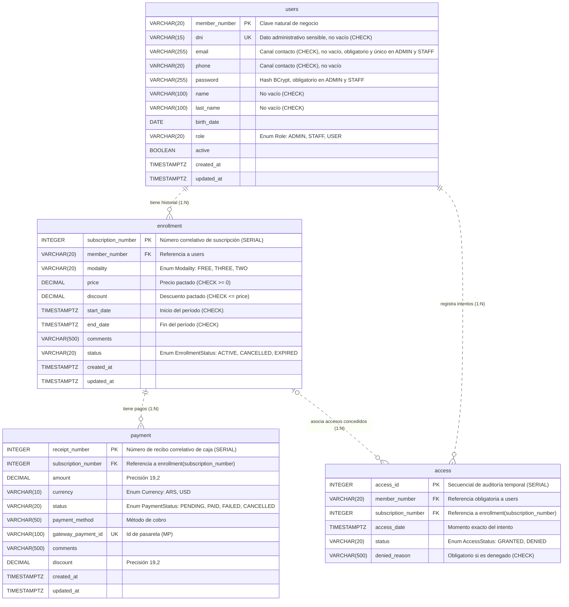

# Modelo Relacional de Base de Datos

Documentación técnica completa del esquema de la base de datos. Este archivo contiene el detalle de cada tabla, sus columnas, tipos de datos, restricciones y las relaciones entre ellas. La versión resumida y orientada al uso está en el `README.md`.

## Diagrama de entidades

```mermaid
erDiagram
    users {
        VARCHAR(20) member_number PK "Clave natural de negocio"
        VARCHAR(15) dni UK "Dato administrativo sensible, no vacío (CHECK)"
        VARCHAR(255) email "Canal contacto (CHECK), no vacío, obligatorio y único en ADMIN y STAFF"
        VARCHAR(20) phone "Canal contacto (CHECK), no vacío"
        VARCHAR(255) password "Hash BCrypt, obligatorio en ADMIN y STAFF"
        VARCHAR(100) name "No vacío (CHECK)"
        VARCHAR(100) last_name "No vacío (CHECK)"
        DATE birth_date
        VARCHAR(20) role "Enum Role: ADMIN, STAFF, USER"
        BOOLEAN active
        TIMESTAMPTZ created_at
        TIMESTAMPTZ updated_at
    }
    enrollment {
        INTEGER subscription_number PK "Número correlativo de suscripción (SERIAL)"
        VARCHAR(20) member_number FK "Referencia a users"
        VARCHAR(20) modality "Enum Modality: FREE, THREE, TWO"
        DECIMAL price "Precio pactado (CHECK >= 0)"
        DECIMAL discount "Descuento pactado (CHECK <= price)"
        TIMESTAMPTZ start_date "Inicio del período (CHECK)"
        TIMESTAMPTZ end_date "Fin del período (CHECK)"
        VARCHAR(500) comments
        VARCHAR(20) status "Enum EnrollmentStatus: ACTIVE, CANCELLED, EXPIRED"
        TIMESTAMPTZ created_at
        TIMESTAMPTZ updated_at
    }
    payment {
        INTEGER receipt_number PK "Número de recibo correlativo de caja (SERIAL)"
        INTEGER subscription_number FK "Referencia a enrollment(subscription_number)"
        DECIMAL amount "Precisión 19,2"
        VARCHAR(10) currency "Enum Currency: ARS, USD"
        VARCHAR(20) status "Enum PaymentStatus: PENDING, PAID, FAILED, CANCELLED"
        VARCHAR(50) payment_method "Método de cobro"
        VARCHAR(100) gateway_payment_id UK "Id de pasarela (MP)"
        VARCHAR(500) comments
        DECIMAL discount "Precisión 19,2"
        TIMESTAMPTZ created_at
        TIMESTAMPTZ updated_at
    }
    access {
        INTEGER access_id PK "Secuencial de auditoría temporal (SERIAL)"
        VARCHAR(20) member_number FK "Referencia obligatoria a users"
        INTEGER subscription_number FK "Referencia a enrollment(subscription_number)"
        TIMESTAMPTZ access_date "Momento exacto del intento"
        VARCHAR(20) status "Enum AccessStatus: GRANTED, DENIED"
        VARCHAR(500) denied_reason "Obligatorio si es denegado (CHECK)"
    }
    users ||..o{ enrollment : "tiene historial (1:N)"
    users ||..o{ access : "registra intentos (1:N)"
    enrollment ||..o{ payment : "tiene pagos (1:N)"
    enrollment |o..o{ access : "asocia accesos concedidos (1:N)"
```

**Notación del diagrama:** la línea punteada representa una relación no identificadora (el hijo tiene su propia clave primaria y solo referencia al padre).
## Justificación de Claves

Para garantizar la solidez del modelo relacional y evitar el abuso de IDs artificiales, se aplicaron los siguientes criterios de selección de claves primarias:

| Entidad | ¿Posee Clave Natural Estable? | Naturaleza Conceptual | Tipo de PK Seleccionada | Justificación Académica y Operativa |
|---------|-------------------------------|-----------------------|-------------------------|-------------------------------------|
| `users` | Sí (`member_number`) | Fuerte / Negocio | Clave Natural (`member_number`) | Identidad real del socio, credencial física y tipeo en terminales. |
| `access`| No (auditoría secuencial) | Evento temporal puntual | Secuencia Correlativa (`access_id SERIAL`) | Identificador secuencial de evento de auditoría de puerta; desacopla el evento y permite auditar intentos de forma independiente sin sobrecarga de identificadores artificiales ni colisiones. |
| `enrollment` | No (período contractual) | Período contractual dependiente | Secuencia Correlativa (`subscription_number SERIAL`) | Numeración correlativa de suscripción o contrato de mostrador; evita claves subrogadas artificiales y claves compuestas mutables. |
| `payment` | No (transaccional comercial) | Comprobante contable de caja | Secuencia Correlativa (`receipt_number SERIAL`) | Número de recibo correlativo de mostrador para trazabilidad comercial y contable (#00001, #00002). |

## Relaciones

| Relación | Tipo | Descripción |
|----------|------|-------------|
| `users` ↔ `enrollment` | `1:N` (Uno a Muchos), no identificadora | Un usuario puede tener múltiples inscripciones a lo largo del tiempo (historial por período). |
| `users` ↔ `access` | `1:N` (Uno a Muchos), no identificadora | Un usuario puede registrar múltiples intentos de acceso (historial de accesos). |
| `enrollment` ↔ `payment` | `1:N` (Uno a Muchos), no identificadora | Una inscripción puede registrar múltiples pagos o intentos de cobro vinculados por `subscription_number`. |
| `enrollment` ↔ `access` | `1:N` (Uno a Muchos), no identificadora | Una inscripción asocia los accesos concedidos durante su vigencia a través de `subscription_number` (opcional; nulo si el acceso fue denegado sin inscripción activa). |

---

## Tabla: `users`

Representa a un socio, personal o administrador del gimnasio.

**Nota de Privacidad y Contacto:** Se utiliza el número de socio (`member_number`) como identificador principal operativo para proteger el DNI. Para evitar "socios fantasmas", el sistema exige obligatoriamente registrar un email o un teléfono de contacto mediante una restricción de base de datos (`CHECK`).

**Nota sobre el email:** Un mismo email puede repetirse entre socios, por ejemplo cuando una madre o un padre anota a sus hijos con su propio correo. En `ADMIN` y `STAFF` no se puede repetir, sin distinguir mayúsculas de minúsculas, porque es el dato con el que inician sesión. Esto lo controla el índice único parcial `ux_users_email_staff`. Además, `ADMIN` y `STAFF` tienen que tener email y contraseña (`chk_user_staff_login`), porque sin alguno de los dos no podrían iniciar sesión.

**Nota de Escalabilidad (Credenciales opcionales):** Para la versión 1, los usuarios con rol `USER` (Socios) son dados de alta exclusivamente por el administrador y no poseen acceso al sistema, por lo que el campo `password` será nulo para ellos. La tabla se diseñó unificada para permitir a futuro habilitarles credenciales sin reestructurar la base de datos (ej. para un portal de autogestión).

### Tabla `users`

| Columna | Tipo | Nulos | Único | Observación |
|---------|------|-------|-------|-------------|
| `member_number` | VARCHAR(20) | No | Sí (PK) | Clave primaria natural |
| `dni` | VARCHAR(15) | No | Sí (UK)| Dato administrativo sensible. No puede quedar vacío (CHECK) |
| `email` | VARCHAR(255)| Sí | Solo ADMIN y STAFF | Restricción CHECK: email o phone obligatorios. Obligatorio en ADMIN y STAFF. Si se carga, no puede quedar vacío |
| `phone` | VARCHAR(20) | Sí | — | Restricción CHECK: email o phone obligatorios. Si se carga, no puede quedar vacío |
| `password` | VARCHAR(255)| Sí | — | Hash BCrypt. Obligatorio en ADMIN y STAFF (CHECK) |
| `name` | VARCHAR(100) | No | — | No puede quedar vacío (CHECK) |
| `last_name` | VARCHAR(100) | No | — | No puede quedar vacío (CHECK) |
| `birth_date` | DATE | Sí | — | |
| `role` | VARCHAR(20) | No | — | Valor del Enum `Role` (Por defecto `USER`, restricción CHECK) |
| `active` | BOOLEAN | No | — | Valor por defecto `true` |
| `created_at` | TIMESTAMPTZ | No | — | Por defecto `CURRENT_TIMESTAMP` |
| `updated_at` | TIMESTAMPTZ | Sí | — | Sin actualización automática en la base. La aplicación deberá asignarlo al modificar el registro |

---

## Tabla: `enrollment`

Representa la inscripción de un usuario a un plan, con su modalidad y vigencia.

**Nota de Vigencia:** cada inscripción es un período cerrado: siempre tiene fecha de inicio y de fin, y cada renovación genera una inscripción nueva. Una inscripción está vigente cuando `start_date <= momento < end_date`: el inicio se incluye y el fin no. Así, una renovación puede empezar en el mismo instante en que termina la anterior sin que se superpongan. La restricción `chk_enrollment_dates` exige que el fin sea posterior al inicio.

**Nota de Cupo Semanal:** la tabla no guarda un contador de accesos. El tope surge de la modalidad (`THREE`: 3, `TWO`: 2, `FREE`: sin tope) y los accesos ya usados se cuentan en la tabla `access` (ver Fundamentos de Diseño Relacional, punto 7).

**Nota de Condiciones Financieras:** cada inscripción congela el precio pactado (`price`) y el descuento concedido (`discount`) al momento del alta, asegurando la inmutabilidad histórica frente a futuros aumentos de tarifas. Las restricciones `chk_enrollment_price` y `chk_enrollment_discount` exigen que el precio sea no negativo y que el descuento no supere dicho precio.

**Nota de Baja Lógica y Solapamiento:** la tabla implementa baja lógica mediante la columna `status` (`ACTIVE`, `CANCELLED`, `EXPIRED`). Para evitar inconsistencias operativas sin delegar la integridad exclusivamente a la aplicación, el motor de base de datos prohíbe el solapamiento de períodos vigentes para un mismo socio mediante una restricción de exclusión (`no_overlap_enrollment` vía `EXCLUDE USING gist`). Dicha restricción se aplica únicamente sobre inscripciones no canceladas (`WHERE status != 'CANCELLED'`), permitiendo registrar nuevas inscripciones sin conflictos si un período anterior fue dado de baja.

| Columna | Tipo | Nulos | Único | Observación |
|---------|------|-------|-------|-------------|
| `subscription_number` | SERIAL / INTEGER | No (generado) | Sí (PK) | Clave primaria. Número correlativo autoincremental de suscripción |
| `member_number` | VARCHAR(20) | No | — | FK a `users.member_number` (`ON DELETE RESTRICT`) |
| `modality` | VARCHAR(20) | No | — | Valor del Enum `Modality` (Restricción CHECK) |
| `price` | DECIMAL(19,2) | No | — | Precio pactado al suscribirse. Restricción CHECK: `price >= 0` |
| `discount` | DECIMAL(19,2) | Sí | — | Descuento aplicado al suscribirse. Restricción CHECK: `discount IS NULL OR (discount >= 0 AND discount <= price)` |
| `start_date` | TIMESTAMPTZ | No | — | Inicio del período (incluido). Restricción CHECK: anterior a `end_date` |
| `end_date` | TIMESTAMPTZ | No | — | Fin del período (excluido). Restricción CHECK: posterior a `start_date` |
| `comments` | VARCHAR(500) | Sí | — | |
| `status` | VARCHAR(20) | No | — | Valor del Enum `EnrollmentStatus` (Por defecto `ACTIVE`, restricción CHECK) |
| `created_at` | TIMESTAMPTZ | No | — | Por defecto `CURRENT_TIMESTAMP` |
| `updated_at` | TIMESTAMPTZ | Sí | — | Sin actualización automática en la base. La aplicación deberá asignarlo al modificar el registro |

---

## Tabla: `access`

Registra cada intento de ingreso validado en la terminal de acceso.

| Columna | Tipo | Nulos | Único | Observación |
| `access_id` | SERIAL / INTEGER | No (generado) | Sí (PK) | Clave primaria secuencial de auditoría temporal |
| `member_number` | VARCHAR(20) | No | — | FK a `users.member_number` (`ON DELETE RESTRICT`) |
| `subscription_number` | INTEGER | Sí | — | FK a `enrollment.subscription_number` (`ON DELETE RESTRICT`). Obligatorio si el acceso es `GRANTED`, opcional si es `DENIED` (`chk_access_logic`) |
| `access_date` | TIMESTAMPTZ | No | — | Momento exacto del intento. Por defecto `CURRENT_TIMESTAMP` |
| `status` | VARCHAR(20) | No | — | Valor del Enum `AccessStatus` (Sin valor por defecto, restricción CHECK) |
| `denied_reason` | VARCHAR(500) | Sí | — | Motivo del rechazo. Obligatorio si el acceso es `DENIED` (`chk_access_logic`) |

---

## Tabla: `payment`

Registra un pago asociado a una inscripción.

| Columna | Tipo | Nulos | Único | Observación |
|---------|------|-------|-------|-------------|
| `receipt_number` | SERIAL / INTEGER | No (generado) | Sí (PK) | Clave primaria. Número de recibo correlativo de caja |
| `subscription_number` | INTEGER | No | — | FK a `enrollment.subscription_number` (`ON DELETE RESTRICT`) |
| `amount` | DECIMAL(19,2) | No | — | Monto del pago. Restricción CHECK: `amount > 0` |
| `currency` | VARCHAR(10) | No | — | Valor Enum `Currency` (Por defecto `ARS`, restricción CHECK) |
| `status` | VARCHAR(20) | No | — | Valor del Enum `PaymentStatus` (Por defecto `PENDING`, restricción CHECK) |
| `payment_method` | VARCHAR(50) | Sí | — | Método de pago (ej. tarjeta, mercadopago) |
| `gateway_payment_id` | VARCHAR(100) | Sí | Sí (UK) | Id devuelto por la pasarela de pagos |
| `comments` | VARCHAR(500) | Sí | — | |
| `discount` | DECIMAL(19,2) | Sí | — | Descuento aplicado en el pago. Restricción CHECK: `discount IS NULL OR (discount >= 0 AND discount <= amount)` |
| `created_at` | TIMESTAMPTZ | No | — | Por defecto `CURRENT_TIMESTAMP` |
| `updated_at` | TIMESTAMPTZ | Sí | — | Sin actualización automática en la base. La aplicación deberá asignarlo al modificar el registro |

---

## Dominios de Valores (Enums)

Para garantizar la integridad de los datos a nivel conceptual, los siguientes campos operan bajo dominios de valores cerrados y están validados a nivel de motor de base de datos (`CHECK`):

### `Role` (Tabla `users`)
- `ADMIN`: Personal con acceso total al panel administrativo.
- `STAFF`: Personal operativo (instructores, recepcionistas).
- `USER`: Socio / usuario (sin acceso al sistema en V1; reservado para escalabilidad futura).

### `Modality` (Tabla `enrollment`)
- `FREE`: Acceso ilimitado.
- `THREE`: 3 accesos por semana.
- `TWO`: 2 accesos por semana.

### `EnrollmentStatus` (Tabla `enrollment`)
- `ACTIVE`: Inscripción activa y vigente en el sistema.
- `CANCELLED`: Inscripción cancelada / dada de baja lógica (libera el rango temporal para nuevas suscripciones y conserva pagos/accesos históricos).
- `EXPIRED`: Inscripción cuyo período de vigencia ha finalizado.

### `Currency` (Tabla `payment`)
- `ARS`: Peso argentino.
- `USD`: Dólar estadounidense.

### `PaymentStatus` (Tabla `payment`)
- `PENDING`: Pago pendiente de confirmación.
- `PAID`: Pago completado y acreditado.
- `FAILED`: Pago fallido o rechazado.
- `CANCELLED`: Pago cancelado para auditoría.

### `AccessStatus` (Tabla `access`)
- `GRANTED`: Acceso permitido.
- `DENIED`: Acceso denegado.

## Índices

PostgreSQL crea automáticamente un índice por cada clave primaria y por cada restricción `UNIQUE` (`users.member_number`, `users.dni`, `enrollment.subscription_number`, `payment.receipt_number`, `payment.gateway_payment_id` y `access.access_id`), y otro para la restricción de exclusión `no_overlap_enrollment`: un índice GiST sobre el socio y el rango de fechas de `enrollment`, sin las inscripciones canceladas (ver Fundamentos de Diseño Relacional, punto 9). Pero no indexa las claves foráneas. Por eso el esquema define los siguientes índices B-Tree:

| Índice | Tabla (columna) | Consultas que acelera |
|---|---|---|
| `ux_users_email_staff` | `users` (`LOWER(email)`), solo filas `ADMIN` y `STAFF` | Búsqueda del usuario por email al iniciar sesión (RF-01); para usar el índice, el login tiene que comparar con `LOWER(email)`. Además es único sin distinguir mayúsculas: dos cuentas del personal no pueden tener el mismo email. |
| `ix_enrollment_member_number` | `enrollment` (`member_number`) | Historial de inscripciones en la ficha del socio y búsqueda de la inscripción vigente en cada validación de acceso. También el control de `ON DELETE RESTRICT` al intentar borrar un socio. |
| `ix_payment_subscription_number` | `payment` (`subscription_number`) | Pagos de una inscripción al cobrar en caja y al controlar la cuota. También el control de `RESTRICT` al intentar borrar una inscripción. |
| `ix_access_subscription_number` | `access` (`subscription_number`) | Accesos habilitados por una inscripción (auditoría). También el control de `RESTRICT` al intentar borrar una inscripción. |
| `ix_access_access_date` | `access` (`access_date`) | Consultas por fecha sobre todos los socios: accesos del día, horarios pico del dashboard y filtros `from` / `to` de RF-17. |

## Fundamentos de Diseño Relacional

Para el modelado de esta base de datos, se aplicaron estrictos criterios de diseño relacional, priorizando el uso de claves naturales y compuestas sobre la asignación automática de identificadores subrogados, salvo en casos donde la mutabilidad o la integración externa lo requieran.

**1. Uso de Claves Naturales y Secuencias de Negocio frente a Identificadores Artificiales**

El "número de socio" es la identidad unívoca del cliente. Es el dato que el usuario digita en la terminal de acceso. Utilizar `member_number` como PK elimina la sobrecarga de mantener dos identificadores únicos concurrentes (un identificador artificial + el número de socio), simplificando drásticamente las consultas (JOIN) con las tablas dependientes.

**2. Criterio de Privacidad frente al DNI (Privacy by Design)**

Aunque el DNI es natural y único, identifica a la persona ante el Estado. Su exposición indebida en pantallas de terminales de acceso representa un riesgo de privacidad.
Por lo tanto, el DNI se aisló con una restricción `UNIQUE NOT NULL` como clave alternativa exclusivamente para fines administrativos (legajo, facturación), pero no participa como identificador relacional en las transacciones operativas diarias.

**3. Garantía de Canal de Contacto**

Para evitar el registro de "socios fantasmas" incontactables ante vencimientos, se implementó una restricción a nivel de motor de base de datos: `CONSTRAINT chk_user_contact CHECK (email IS NOT NULL OR phone IS NOT NULL)`. Esto garantiza que se registre al menos un dato de contacto, sin hacer obligatorios ambos. La restricción comprueba que el dato exista, no que sea válido: un valor mal escrito la cumple igual (los vacíos los rechazan `chk_user_email` y `chk_user_phone`), por lo que el formato del email y del teléfono lo valida la aplicación al dar de alta al socio.

**4. Identificador Secuencial en Eventos Temporales de Auditoría (`access`)**

Un intento de acceso en la terminal es un evento temporal de auditoría. Se identifica mediante una secuencia correlativa de auditoría (`access_id SERIAL`), lo que independiza la identidad del registro de los datos ingresados y permite registrar eventos con precisión temporal sin colisiones ni sobrecarga de identificadores artificiales. La inmutabilidad del registro la asegura la aplicación, que no expone operaciones de modificación ni de borrado (Módulo Access, regla 2).

**5. Identificadores Correlativos de Mostrador frente a Identificadores Artificiales (`subscription_number` y `receipt_number`)**
*   **En `enrollment` (Correlativo de Suscripción):** En el funcionamiento real de un gimnasio, los contratos o inscripciones no son identificados por cadenas hexadecimales abstractas. Se utiliza un número correlativo humano (`subscription_number SERIAL`) que proporciona una identidad inmutable para el contrato y sus extensiones sin requerir identificadores artificiales complejos ni PKs compuestas mutables basadas en fechas.
*   **En `payment` (Recibo Comercial):** Todo cobro en mostrador genera un comprobante o recibo con numeración correlativa (`receipt_number SERIAL`), facilitando la rendición de caja y el entendimiento para el cliente. Para la integración con pasarelas de pago externas (ej. Mercado Pago), el id de transacción que devuelve la pasarela se guarda en `gateway_payment_id`, que es `UNIQUE`: la base no permite registrar dos veces el mismo pago de Mercado Pago. Además, como un pago `PAID` no se modifica (regla 2 del módulo Payment), una notificación repetida no cambia un pago ya acreditado.
*   **Eliminación Total de Identificadores Artificiales Abstractos:** Se prescinde por completo de identificadores artificiales abstractos (como identificadores aleatorios opacos) en el modelo de datos del gimnasio, alineándose con las buenas prácticas de diseño conceptual y relacional donde priman claves naturales y correlativas legibles.
**6. Conservación del Historial (`ON DELETE RESTRICT`)**

Todas las claves foráneas del esquema se declaran con `ON DELETE RESTRICT`: el motor rechaza la eliminación de un socio o de una inscripción mientras existan inscripciones, pagos o accesos que los referencien. De este modo, un borrado accidental no puede arrastrar comprobantes de pago ni eventos de acceso, que las reglas de negocio definen como registros de auditoría. Las bajas de usuarios se resuelven de forma lógica mediante `users.active`, sin eliminación física.
No se utiliza `ON DELETE SET NULL` en `access`: `member_number` es la referencia obligatoria al socio y `subscription_number` es la referencia que permite auditar qué inscripción habilitó cada acceso concedido.
El alcance de esta restricción es proteger a los registros padre: no impide eliminar directamente una fila de `payment` o de `access`. La aplicación deberá impedir el borrado de pagos y la modificación o eliminación de accesos (Módulo Payment, regla 2; Módulo Access, regla 2). Los pagos acreditados conservarán sus datos financieros y podrán pasar a `CANCELLED` según la regla de negocio definida.

**7. Cupo Semanal Calculado, no Almacenado**

Los accesos que un socio ya usó en la semana no se guardan en una columna: se obtienen contando sus accesos `GRANTED` en la tabla `access` desde el lunes a las 00:00 de la semana en curso. El tope se deduce de la modalidad de la inscripción vigente (`THREE`: 3, `TWO`: 2, `FREE`: sin tope).
Guardar un contador en `enrollment` implicaba repetir un dato que ya existe en `access`, con el riesgo de que ambos dejen de coincidir si falla la actualización de uno de ellos. También exigía una columna con la fecha del último reinicio, nula hasta el primer lunes, y un proceso que reiniciara el contador cada semana. Con el conteo, `access` es la única fuente del dato y no queda ningún campo que mantener.
El conteo se hace por socio y no por inscripción: si un socio renueva a mitad de semana, los accesos que ya usó esa semana siguen contando.

**8. Fechas con Zona Horaria (`TIMESTAMPTZ`)**

Todas las columnas de fecha y hora se declaran `TIMESTAMPTZ` (`timestamp with time zone`). PostgreSQL guarda cada valor como un instante absoluto (en UTC) y lo muestra convertido a la zona horaria de la sesión, de modo que un acceso representa el mismo momento sin importar desde dónde se consulte. `birth_date` se mantiene como `DATE`, porque una fecha de nacimiento no es un instante.
Con `TIMESTAMP` (sin zona), la base guarda la fecha y la hora tal como llegan, sin saber a qué zona corresponden. El backend se desplegará en Render y la base en Neon, que por defecto trabajan en UTC, mientras que el gimnasio opera en hora de Argentina (UTC−3). Un acceso del domingo a las 22:30 en el gimnasio es el lunes a la 01:30 en UTC: guardado sin zona, el mismo registro podría interpretarse en un día distinto según quién lo lea, y los horarios pico del dashboard aparecerían corridos tres horas.
Las reglas que dependen del día o de la semana se evalúan en la zona horaria del gimnasio. Para el cupo semanal (punto 7), el inicio de la semana se calcula como `date_trunc('week', now(), 'America/Argentina/Buenos_Aires')`: calculado en UTC, el acceso del domingo a las 22:30 se contaría en la semana siguiente.

**9. Prevención de Solapamiento Temporal y Baja Lógica (`enrollment`)**

Para garantizar que un socio no posea simultáneamente dos períodos de suscripción activos o superpuestos en el tiempo, el esquema implementa una restricción de exclusión a nivel de motor:
`CONSTRAINT no_overlap_enrollment EXCLUDE USING gist (member_number WITH =, tstzrange(start_date, end_date, '[)') WITH &&) WHERE (status != 'CANCELLED')`.

- **Uso de `btree_gist`:** PostgreSQL no admite de forma nativa la combinación de tipos escalares (como `VARCHAR` en `member_number` con el operador `=`) junto con rangos geométricos o temporales dentro de un índice GiST. La extensión `btree_gist` habilita esta compatibilidad, permitiendo evaluar la igualdad de socio y el solapamiento de rangos en un único índice eficiente.
- **Rango semiabierto `[)`:** El rango temporal `tstzrange(start_date, end_date, '[)')` incluye el instante de inicio (`start_date`) y excluye el de finalización (`end_date`). Esta formulación matemática modela con precisión la regla de vigencia del gimnasio, permitiendo que una renovación inicie exactamente en el mismo instante en que expira el período previo sin generar colisiones ni falsos positivos de solapamiento.
- **Baja Lógica y Conservación Histórica (RF-11):** La eliminación física mediante `DELETE` vulneraría la integridad referencial (`ON DELETE RESTRICT`) si la membresía ya cuenta con pagos registrados (`payment`) o ingresos en terminal (`access`). Para preservar la inmutabilidad y trazabilidad de estos registros contables y de auditoría, las cancelaciones se resuelven actualizando el estado a `CANCELLED`. Gracias al predicado parcial `WHERE (status != 'CANCELLED')`, al cancelar una inscripción futura o anticipada, el rango temporal queda inmediatamente liberado para registrar una nueva suscripción sin bloqueos.

