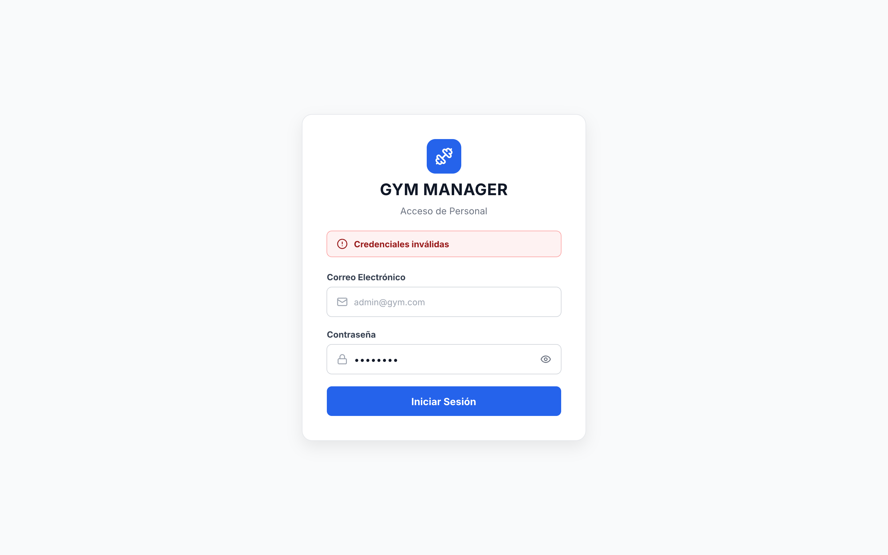
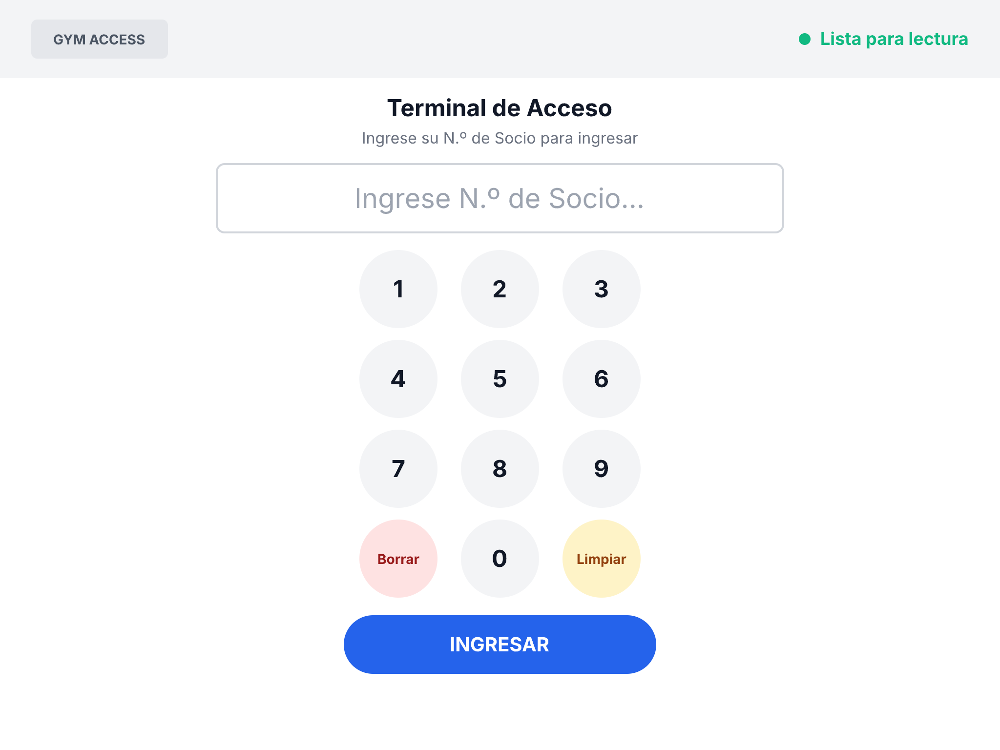
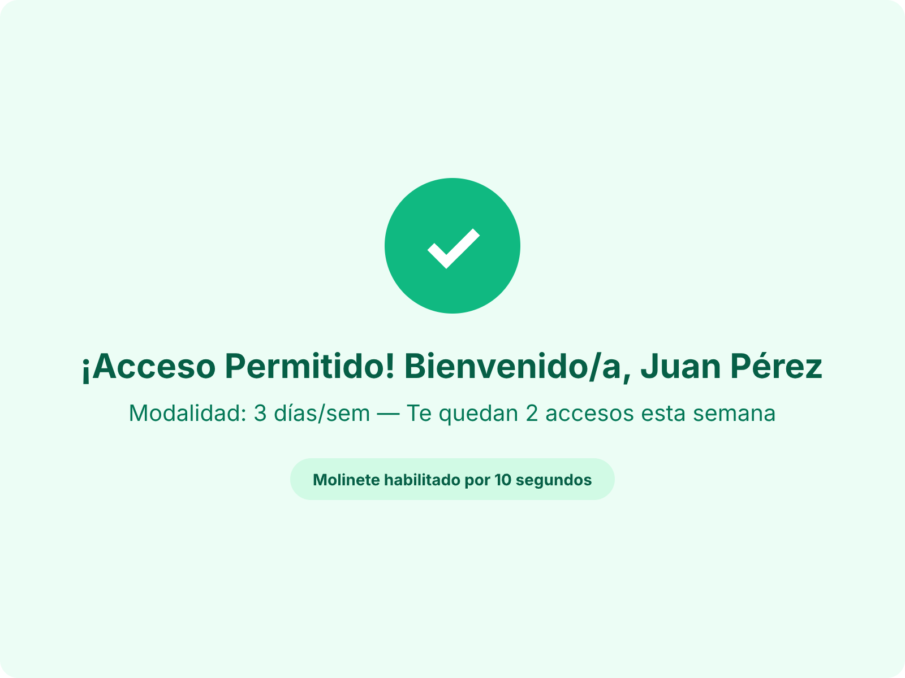
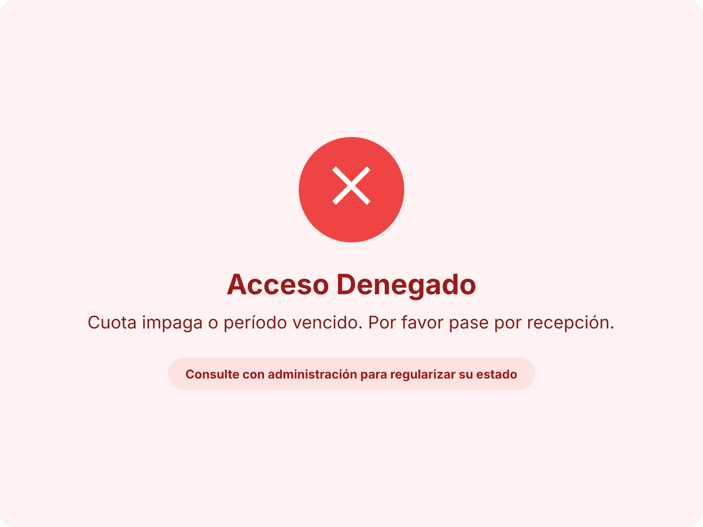

# Especificación y Diseño de Mockups (UX / UI)

> **Canvas interactivo en Pen.dev:**  
> Se pueden visualizar y explorar todas las pantallas y flujos interactivos en línea en el siguiente enlace:  
> [Ver Mockups en Pen.dev](https://app.pen.dev/s/XTE4g4iJ2m6UI0SEn_EB-jrnqsraz2sCoa6JK_mOk_A)

---

## 1. Criterios Generales de Diseño

1. **Privacy by Design en Terminal de Acceso:**
   - La terminal de acceso en puerta/molinete opera exclusivamente con el **Número de Socio** (`member_number`).
   - El DNI no se solicita ni se muestra en la pantalla de la terminal pública, reservándose exclusivamente para gestiones administrativas internas en recepción.
2. **Validación Visual de Contacto Obligatorio:**
   - En el alta y edición de socios, la interfaz exige de forma obligatoria al menos un canal de contacto válido (email o teléfono), con validación visual en formulario.
3. **Modalidades de Acceso del Dominio:**
   - Las interfaces reflejan con claridad las tres modalidades del sistema:
     - `FREE`: Acceso libre e ilimitado.
     - `THREE_DAYS`: Límite de 3 accesos semanales con contador visible de accesos restantes.
     - `TWO_DAYS`: Límite de 2 accesos semanales con contador visible de accesos restantes.
4. **Diferenciación de Roles y Control de Acceso (RBAC):**
   - El panel administrativo distingue visualmente en su cabecera y barra lateral entre el personal operativo de recepción (`STAFF`) y la administración general (`ADMIN`).
   - Las opciones de configuración de tarifas/planes y la emisión de comunicados masivos se reservan visualmente para el rol `ADMIN`.

---

## 2. Pantallas del Sistema

### Pantalla 0: Inicio de Sesión / Login (Staff y Administrador)

Puerta de entrada al panel web administrativo (`gym-frontend-admin`), securizada mediante autenticación JWT (RF-01).

- **Estructura y Disposición:** Tarjeta central centrada en pantalla sobre fondo neutro (resolución base 1440 × 900 px).
- **Identidad:** Logo del gimnasio, título "Gym Manager" y subtítulo "Acceso de Personal".
- **Formulario de Autenticación:**
  - Campo "Correo Electrónico" con validación de formato.
  - Campo "Contraseña" con visibilidad alternable.
- **Acción Principal:** Botón "Iniciar Sesión" en azul primario de ancho completo.
- **Manejo de Errores y Feedback:**
  - Alerta visual en banner rojo ante credenciales incorrectas (*"Credenciales inválidas"*).
  - Alerta ante cuenta de usuario inactiva (*"Cuenta desactivada. Consulte con administración"*).



---

### Pantalla 1: Terminal de Acceso (Autogestión / Molinete)

Diseñada para pantalla táctil en tótem o tablet junto al molinete de entrada (resolución base 1024 × 768 px).

#### Estado de Reposo / Espera de Lectura
- **Barra Superior:** Identificación del gimnasio e indicador de estado de conexión en vivo ("Lista para lectura").
- **Display de Ingreso:** Campo central de alta legibilidad para el ingreso del Número de Socio.
- **Teclado Numérico Táctil (Keypad 3×4):** Botones circulares grandes con números 1 a 9, 0, botón de "Borrar" (último dígito) y "Limpiar" (campo completo).
- **Botón de Acción:** "INGRESAR" en color contrastante para enviar la validación.



#### Estado de Feedback: Acceso Concedido (Granted)
- Círculo de confirmación con tilde (`✓`) sobre fondo verde claro.
- Mensaje de bienvenida personalizado con nombre del socio.
- Resumen de modalidad y cupo semanal restante (ej. *"Modalidad: 3 días/sem — Te quedan 2 accesos esta semana"*).
- Notificación de molinete desbloqueado por tiempo acotado (10 segundos).



#### Estado de Feedback: Acceso Denegado (Denied)
- Círculo de advertencia con cruz (`✕`) sobre fondo rojo claro.
- Motivo claro del bloqueo (ej. *"Cuota impaga o período vencido"* o *"Cupo semanal agotado"*).
- Instrucción clara de derivación a recepción para regularizar la situación.



---

### Pantalla 2: Panel de Recepción y Gestión de Socios (Staff)

Diseñada para el personal administrativo y operativo en puesto de recepción (resolución desktop 1440 × 900 px).

- **Barra Superior y Navegación:**
  - Identificador del operador conectado y badge de rol activo (`STAFF` o `ADMIN`).
  - Menú lateral con accesos directos: Socios, Caja / Inscripciones, Accesos, Dashboard y Configuración.
- **Buscador Omnibox:** Búsqueda rápida e incremental por DNI, N.º de Socio, Apellido o Nombre.
- **Tabla General de Socios:**
  - Columnas: N.º Socio, Nombre completo, DNI, Estado de Membresía (badge Activo / Inactivo / Vencido), Modalidad actual, Acciones rápidas.
  - Filtros superiores por estado (Todos, Activos, Inactivos, Vencidos) y paginación.
  - Acciones rápidas por fila:
    - Botón "Ficha / Historial" (abre el modal de historial de asistencias).
    - Botón "Cobrar" (atajo directo al módulo de caja con el socio preseleccionado).
    - Botón de alternancia de activación/desactivación lógica de la cuenta (RF-06).
- **Modal de Alta / Edición de Socio:**
  - Datos personales: Nombre, Apellido, DNI, Fecha de Nacimiento.
  - Datos de contacto: Email y Teléfono (con validación visual: al menos un canal es estrictamente obligatorio por RF-04).
  - Selector de plan/modalidad inicial.
- **Modal de Ficha e Historial de Asistencias (RF-17):**
  - Encabezado con datos consolidados del socio y resumen de cupo semanal consumido vs disponible.
  - Tabla cronológica de auditoría de ingresos: Fecha y hora exacta, resultado (`GRANTED` en verde / `DENIED` en rojo) y motivo registrado en caso de rechazo.

---

### Pantalla 3: Módulo de Inscripción y Cobro en Mostrador (Caja)

- **Cabecera de Operación:** Indicador del socio seleccionado (N.º Socio, Nombre, DNI) y operador a cargo del cobro.
- **Selección de Plan y Período:** Dropdown de modalidades disponibles y definición de vigencia (período mensual cerrado).
- **Desglose de Liquidación:** Monto base del plan, recargos o descuentos si aplicaran, y total a cobrar.
- **Medios de Cobro:**
  - Registro de pago en efectivo con campo de monto recibido y cálculo automático de vuelto.
  - Integración digital: Contenedor con código QR dinámico de Mercado Pago para escaneo y confirmación de cobro.
- **Emisión de Comprobante:** Opción de impresión o envío automático de constancia de pago por correo electrónico.

---

### Pantalla 4: Dashboard Administrativo y Métricas de Acceso

Diseñada para la supervisión operativa y gerencial (acceso completo para `ADMIN`, vista operativa para `STAFF`).

- **Tarjetas KPI Principales:**
  - Socios activos totales.
  - Ingresos recaudados en el período corriente.
  - Concurrencia diaria actual (accesos registrados en el día).
  - Tasa de rechazos en molinete (por cuota vencida o exceso de cupo).
- **Gráficos Operativos:**
  - Distribución horaria de accesos (gráfico de barras identificando horas pico).
  - Distribución de socios por modalidad (gráfico circular/dona: Libre, 3 días, 2 días).
- **Feed de Accesos en Tiempo Real:** Lista con las últimas validaciones del molinete indicando hora, socio, modalidad y resultado.
- **Modal de Comunicaciones y Avisos Masivos (Exclusivo ADMIN):**
  - Acceso desde botón de acción en cabecera ("Gestionar Comunicaciones").
  - Pestaña de Comunicado Masivo (Broadcast): Selección de destinatarios (Todos los socios, Solo activos, Solo cuotas vencidas), campo de Asunto y cuerpo del mensaje para envío por correo electrónico.
  - Pestaña de Recordatorios Automáticos: Visualización de plantilla de aviso preventivo de vencimiento y monitor de envíos automáticos.

---

### Pantalla 5: Configuración de Planes y Modalidades (Exclusivo ADMIN)

Módulo de administración tarifaria con acceso restringido para usuarios con rol `ADMIN`.

- **Listado de Planes del Gimnasio:** Visualización de planes vigentes, precios actualizados y límite semanal de accesos.
- **Formulario de Alta / Modificación de Planes:**
  - Nombre del plan.
  - Modalidad asociada (`FREE`, `THREE_DAYS`, `TWO_DAYS`).
  - Arancel mensual.
  - Estado de vigencia (activo / deshabilitado para nuevas inscripciones).
---

## 3. Formato de Entregables y Estructura en el Repositorio

```text
docs/
├── mockup.md                <-- Especificación y visualización de bocetos (este documento)
└── mockups/
    └── img/                 <-- Exportaciones PNG de alta resolución
        ├── terminal_acceso_reposo.png
        ├── terminal_acceso_concedido.png
        └── terminal_acceso_denegado.png
```

- **Lienzo online (Pen.dev):** Permite navegar, inspeccionar e interactuar con el diseño y sus componentes directamente desde el navegador a través del enlace en [Pen.dev](https://app.pen.dev/s/XTE4g4iJ2m6UI0SEn_EB-jrnqsraz2sCoa6JK_mOk_A).
- **Imágenes exportadas (`.png`):** Permiten la visualización estática directa en GitHub y en cualquier visor de Markdown sin dependencias externas.
